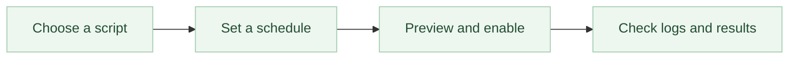
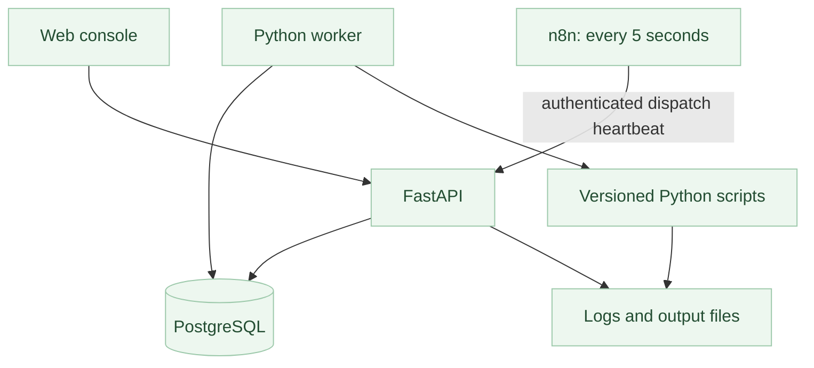

# Sleep In · 不再早起

**Let your tasks take the early shift.**

Schedule Python scripts, follow every run, and get your mornings back.

English · [简体中文](README.zh-CN.md)

[](https://github.com/haowenchen0811/sleep-in/actions/workflows/ci.yml) · [MIT license](LICENSE)

A self-hosted task console for people who want a schedule, parameters, logs, and downloadable results without opening a workflow editor. Independently written in Python and browser JavaScript, with **n8n driving scheduled dispatch**.

> Early development release. Use with trusted script authors. This is not a sandbox for code uploaded by strangers. See [verification status](docs/VERIFICATION.md) for what has actually been tested.

## From script to schedule



## What you can do

- Start with three standard-library examples, or publish a Python file or ZIP project.
- Choose manual, interval, daily, weekdays, weekly, monthly, or five-field cron schedules.
- Preview upcoming runs in an explicit IANA timezone, including daylight-saving rules.
- Pin a script version to each task; queued runs keep their original parameters.
- Read stdout and stderr, cancel a run, set a timeout, and download output files.
- Keep secrets in write-only variables, with administrator and operator roles.
- Use English by default. Switch to 简体中文 at any time, including before sign-in.

No company-specific configuration, cloud account, SMTP account, or existing n8n account is required for the examples.

## Quick start

Install [Docker Desktop](https://www.docker.com/products/docker-desktop/) or Docker Engine with the Compose plugin. Keep Docker running whenever you want scheduled tasks to execute.

```bash
git clone https://github.com/haowenchen0811/sleep-in.git
cd sleep-in
docker compose up -d --build
```

The initial development checkout builds the application image locally. PostgreSQL and n8n use pinned upstream images. Prebuilt application images are produced by the release workflow after tagged releases; do not assume an unpublished image exists.

Get your local, single-use setup token:

```bash
docker compose exec web python -m taskconsole setup-token
```

Open [http://localhost:8080](http://localhost:8080), enter the token, and choose an administrator username, a password of at least 12 characters, and your timezone. The initial interface is always English; select **简体中文** if you prefer it.

1. Select **Create task** and the **Create an output file** example.
2. Choose **Interval**, set **Every (minutes)** to **1**, check the preview, then create and enable it.
3. Open the execution when it finishes and download `hello.txt`.

n8n initializes its dispatch workflow automatically. Its editor and database are not exposed to the host. A task is only reported as ready after a recent n8n heartbeat. Saving a schedule does not immediately execute the script.

## Write a script

For a single Python file, define a synchronous `main(params)` function:

```python
def main(params):
    print(f"Hello, {params.get('name', 'world')}!")
```

Or use a normal top-level script. Read structured parameters and create outputs through the portable environment contract:

```python
import json
import os
from pathlib import Path

params = json.loads(Path(os.environ["TASK_PARAMS_FILE"]).read_text())
output = Path(os.environ["TASK_OUTPUT_DIR"])
(output / "result.txt").write_text(params.get("message", "Hello!"))
```

ZIP projects have a `main.py` entrypoint and may include a `requirements.txt` with pinned `package==version` dependencies. Dependencies are prepared at publication, not at each run. See [script authoring](docs/SCRIPTS.md) for entrypoint semantics, limits, secrets, and dependency behavior.

## How it works



The application owns task definitions and timezone calculations. A single, automatically provisioned n8n workflow wakes dispatch; it does not contain users' source code or parameters. PostgreSQL transactions serialize due-job creation and claims. The worker runs trusted Python in a separate process group, with a minimal environment and no Docker socket.

[Architecture](docs/ARCHITECTURE.md) · [Operations and backup](docs/OPERATIONS.md) · [Contributing](CONTRIBUTING.md)

## Everyday operations

```bash
# Service status
docker compose ps

# Application logs
docker compose logs --tail=100 web worker n8n

# Stop while preserving your data
docker compose stop

# Start again
docker compose start
```

Data is stored in named volumes. **Do not run `docker compose down -v` unless you intend to erase those volumes.** Back up before upgrades; follow the restore procedure rather than copying a live database directory.

## Deliberate boundaries

- One trusted workspace, one worker service, up to 16 concurrent executions. This is not multi-tenant SaaS.
- Missed schedules are recorded as skipped instead of replayed. Weekdays mean Monday–Friday, without holiday calendars.
- Overlapping runs of the same task are skipped. External side effects cannot be guaranteed exactly once; scripts should use `TASK_RUN_ID` when implementing idempotency.
- Your machine must stay on. Sleeping a laptop or stopping Docker stops scheduling.
- A recipient field passes addresses to your script; it does not send email by itself.
- Advanced shared-runtime editing and built-in email notifications are later work.

## Development

Python 3.12+ is required for local development. Docker Compose is the supported full-system deployment path.

```bash
python -m venv .venv
. .venv/bin/activate
pip install -r requirements-dev.txt
python -m pytest -q
```

For an isolated API/UI development instance, SQLite is supported by the test repository adapter:

```bash
python -m taskconsole init
python -m taskconsole serve
# In another terminal, with the same virtual environment:
python -m taskconsole worker
```

This local mode has **no automatic n8n heartbeat**. Manual runs work; scheduled readiness correctly remains unavailable. Use Compose for the complete n8n integration.

## License

The original code in this repository is [MIT licensed](LICENSE). **n8n is a separately licensed dependency** and is not relicensed by this project. See [third-party notices](THIRD_PARTY_NOTICES.md). This project is independent and is not affiliated with n8n.
