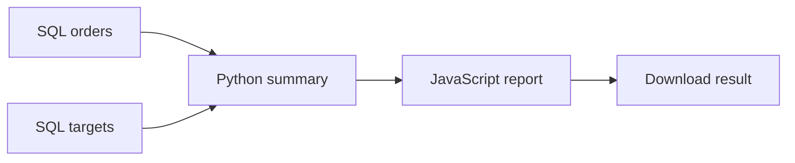

# Sleep In · 不再早起

**Let your workflows take the early shift.**

A self-hosted, visual low-code workspace for complex scheduled workflows.

English · [简体中文](README.zh-CN.md)

[](https://github.com/haowenchen0811/sleep-in/actions/workflows/ci.yml) · [MIT license](LICENSE)

Monday's meeting shouldn't make you wake up early to pull data. Build the preparation flow once, enjoy Sunday evening, and let your computer prepare the report.

A single scheduled script often needs no platform. Sleep In is for the work between scripts: querying different databases, choosing which results feed Python, passing its summary into JavaScript, producing a file, and finding the exact step that failed. You can build and run these workflows without an AI service or a separate n8n account.



This is an independently written application. n8n executes the published dependency graph; Sleep In provides the editor, data contracts, runtime packs, scheduling forms and run history.

> Development preview. [Acceptance evidence](docs/testing/COMPLETE-RESULTS.md) separates implemented/tested software from clean-Mac, signing and physical power-state release gates. Native scripts are trusted administrator code, not an untrusted-code sandbox.

## What you can do

- Drag nodes anywhere. Connect on any side, follow directional arrows, pan/zoom, undo changes, or choose horizontal/vertical layout.
- Use **SQL, Python, JavaScript, Shell, Java, C and C++**. SQL has SQLite, PostgreSQL, MySQL and Oracle receivers.
- Pick upstream fields, constants, workflow parameters, artifacts or credentials as inputs. An ordering connection alone passes no data.
- Branch and merge, test one node with explicit samples, retry safe steps, cancel a run, inspect attempts/logs and download complete results.
- Build immutable runtime versions and upload source files/ZIP projects. Dependencies and compiled projects are prepared before execution.
- Schedule once, daily, on weekdays, weekly, monthly or at an interval using forms, with timezone and upcoming-run previews. No Cron expression is required.
- Configure email/webhook notifications, retention, encrypted backups and migration of classic tasks.
- Start in English and switch to Simplified Chinese without losing your draft.

## Start on your Mac

Apple silicon, macOS 13 or later. The source launcher downloads private Python, Node and n8n runtimes; first installation needs internet and several gigabytes of free space. No Docker or rented server is required.

```sh
git clone https://github.com/haowenchen0811/sleep-in.git
cd sleep-in
./launch-mac.command
```

The launcher opens Terminal during setup. The native **Sleep In.app** wrapper provides installation progress and a menu-bar status without Terminal. Current local builds are ad-hoc signed; a public notarized installer is not claimed. See [Mac installation](docs/MAC.md).

1. Sign in using the fresh local account displayed on the page: **admin / sleepin123456**. Change it in **Account**.
2. Choose **Templates → Guided setup**, then choose the time and timezone.
3. Select **Test and enable schedule**. It tests the complete example and enables the schedule only after success.

The example uses synthetic SQLite orders. No business data or database account is needed. Open the visual editor whenever you want to extend it. [Runtime setup](docs/RUNTIME-API.md) covers optional toolchains and dependencies.

## Install once. Keep workflows running.

The Mac service stays running between daily occurrences, including on battery power. Closing the browser, completing today's run or pausing schedules does not intentionally stop the service. The native companion offers **Start at Login**, with macOS approval, and explicit finish/cancel choices when stopping.

While active, it requests prevention of idle system sleep while allowing display sleep and locking. It does not override lid closure, explicit system sleep, shutdown, overheating or an exhausted battery. This is a persistent service, not a promise that a powered-off computer can execute jobs. Physical AC/battery/lock and overnight verification remain separately recorded release gates. [Power behavior and verification](docs/MAC.md)

**One-click setup. One-click run. More sleep.**

## Optional Docker deployment

```sh
docker compose up -d --build
docker compose exec web python -m taskconsole setup-token
```

Open [localhost:8080](http://localhost:8080), use the one-time token and create your administrator. Docker mode does not use the public local default password. Compose includes the visual workflow worker and preserves the classic scheduler for migration. Start with the same guided template. Keep Docker running for scheduled execution.

The [CI workflow](.github/workflows/ci.yml) tests a clean Compose deployment with an actual scheduled n8n graph and exact output. A configured job is not evidence of a passing run; consult the result for your commit.

## Understand, extend and operate

| Topic | Guide |
| --- | --- |
| Product and acceptance criteria | [PRD](docs/PRD.md) · [中文 PRD](docs/PRD.zh-CN.md) |
| Tests designed before implementation | [Test plan](docs/TEST-PLAN.md) · [Results](docs/testing/COMPLETE-RESULTS.md) |
| Node inputs, retries, triggers and artifacts | [Execution contract](docs/EXECUTION-API.md) |
| Runtime packs and source projects | [Runtime API](docs/RUNTIME-API.md) |
| Notifications, backups and migration | [Operations API](docs/OPERATIONS-API.md) |
| Database certification fixtures | [SQL matrix](docs/testing/external-sql-matrix.md) |
| Contributing | [CONTRIBUTING](CONTRIBUTING.md) · [Security](SECURITY.md) |

```sh
python -m venv .venv
. .venv/bin/activate
pip install -r requirements-dev.txt
python -m pytest -q -ra
```

Integration tests require explicitly configured n8n, toolchain and database fixtures; skipped tests are not passes. The project is licensed under [MIT](LICENSE). n8n and other dependencies keep their own licenses; this license applies to Sleep In's original code.
