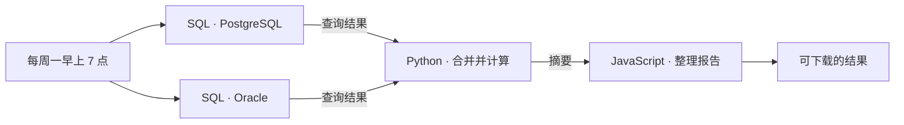
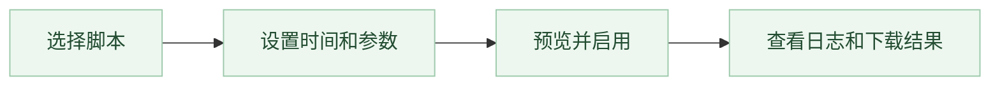
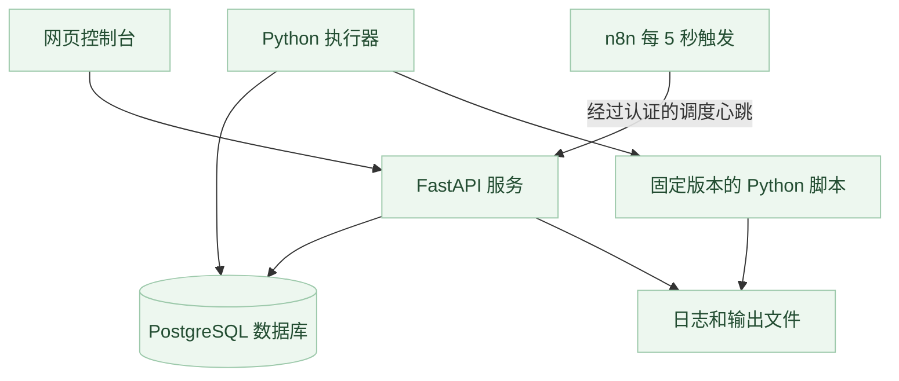

# 不再早起 · Sleep In

**把早班交给任务，把清晨留给自己。**

可视化拖拽的低代码平台，让复杂工作流定时完成——新版本设计中。

[English](README.md) · 简体中文

[](https://github.com/haowenchen0811/sleep-in/actions/workflows/ci.yml) · [MIT 许可证](LICENSE)

Sleep In 正在围绕可视化流程画布重做：连接 SQL 接收器及 Python、JavaScript、Shell 等语言脚本，映射上下游输入输出，通过普通表单定时执行整条流程。独立设计的界面背后，由 n8n 编排已发布的流程图。

> **当前状态：** 仓库现有实现仍是 v1 Python 定时任务控制台。下述拖拽工作流平台与常驻 Mac 安装版属于 v2 需求，尚未发布；详见[中文 PRD](docs/PRD.zh-CN.md)、[English PRD](docs/PRD.md)和[验证记录](docs/VERIFICATION.md)。当前执行器用于可信脚本，不是陌生人代码的安全沙箱。

## 为什么叫“不再早起”？

不要因为周一早上开周会，就得早起拉数据。周日晚上还想继续玩，就把整条准备流程提前搭好，让电脑到点收集、处理数据，早上直接看结果。

单个任务用脚本定时，或者让 AI 安排一次执行，可能已经够用了。复杂的是：先查两个数据库，把输出合并，交给 Python 算指标，再用 JavaScript 整理报告。步骤之间有依赖和数据传递，运行环境不同，失败后还得知道卡在哪一步。**把这些工作变成可复用、看得见、可排查的流程，才是这个项目存在的意义。** AI 可以辅助写代码，但搭建和运行流程不依赖 AI 服务。

## 我们要做的工作流

把语言节点拖进画布，拖动端口连线，点选上游字段，逐步试跑，然后发布并选择普通人能看懂的执行时间。模板是可编辑的起点，画布是主要创作界面；支持分支、并行、汇合和逐节点运行记录，让复杂任务也能看清楚。



以上为设计中的流程示例，不代表 v1 已支持这些集成。节点按语言和 SQL 方言分类；报告、计算属于脚本内容，不另造凑数业务节点。定时使用表单，不用 Cron。默认英文，可切简体中文。

## 安装一次，后台持续运行

Mac 版的目标是安装并完成必要系统授权后，自动启动后台，**插电和电池供电都持续运行**。关闭网页或应用窗口、拔电、今天任务完成，都不应影响明天继续调度。不租服务器，不另注册 n8n，也不用每天点击开启。登录页展示本地初始账号密码，用户可以在账号设置中修改。

后台会申请防空闲系统休眠，同时允许锁屏和熄屏。电池运行仍会耗电；电量耗尽、关机后软件无法执行，防空闲休眠也不能阻止合盖或主动系统睡眠。[Apple 官方边界](https://developer.apple.com/documentation/iokit/kiopmassertiontypepreventuseridlesystemsleep)。安装器和电池运行效果仍需实际开发验证。

**一键部署，一键运行，一键安心睡觉。**

## 当前 v1：从脚本到定时任务



## 当前 v1 功能

- 从三个仅使用标准库的示例开始，或发布 Python 单文件、ZIP 项目。
- 手动、间隔、每天、工作日、每周、每月、五字段 Cron，共七种计划。
- 指定 IANA 时区，预览未来运行时间，并按时区规则处理夏令时。
- 任务固定脚本版本；排队中的执行保留原始参数。
- 查看 stdout 和 stderr，取消执行，设置超时，下载输出文件。
- 使用只写变量保存密钥，区分管理员与操作员角色。
- **默认英文**，登录前后都能切换简体中文；切换语言不改变任务时间。

运行示例无需公司配置、云账号、SMTP 账号或已有的 n8n 账号。

## 运行当前开发版

安装 [Docker Desktop](https://www.docker.com/products/docker-desktop/)，或 Docker Engine 与 Compose 插件。执行定时任务期间，电脑与 Docker 必须持续运行。

```bash
git clone https://github.com/haowenchen0811/sleep-in.git
cd sleep-in
docker compose up -d --build
```

开发版首次在本机构建应用镜像，并下载固定版本的 PostgreSQL 和 n8n 镜像。发布工作流会在创建正式版本标签后生成预构建应用镜像；尚未发布的镜像不可直接使用。

获取本机的一次性初始化令牌：

```bash
docker compose exec web python -m taskconsole setup-token
```

打开 [http://localhost:8080](http://localhost:8080)，输入令牌，设置管理员账号、至少 12 位密码和时区。初始界面为英文，点击 **中文** 即可切换。

1. 点击 **创建任务**，选择 **创建输出文件** 示例。
2. 计划选择 **间隔**，将 **间隔（分钟）** 设为 **1**，查看预览后创建并启用。
3. 等待执行完成，在执行详情下载 `hello.txt`。

n8n 自动初始化调度工作流，其编辑器与数据库不向宿主机开放。收到最近的 n8n 心跳后，平台才会显示调度就绪。保存计划不会立即执行脚本。

## 编写脚本

单文件可定义同步 `main(params)` 入口：

```python
def main(params):
    print(f"Hello, {params.get('name', 'world')}!")
```

也支持普通顶层脚本。通过环境变量读取结构化参数，并将结果写入本次输出目录：

```python
import json
import os
from pathlib import Path

params = json.loads(Path(os.environ["TASK_PARAMS_FILE"]).read_text())
output = Path(os.environ["TASK_OUTPUT_DIR"])
(output / "result.txt").write_text(params.get("message", "Hello!"))
```

ZIP 项目以 `main.py` 为入口，可在 `requirements.txt` 中使用 `包名==版本` 固定依赖。依赖在发布时准备，不在每次运行时重复安装。入口语义、限制、密钥与依赖说明见[脚本编写指南](docs/SCRIPTS.md)。

## 当前 v1 架构



任务定义与时区计算由应用管理。一个自动配置的 n8n 工作流负责唤起调度，不保存用户的源码或参数。PostgreSQL 事务将到期任务的创建与领取串行化。执行器在独立进程组内运行可信 Python，使用最小环境变量集，不挂载 Docker socket。

[架构说明](docs/ARCHITECTURE.md) · [运维与备份](docs/OPERATIONS.md) · [参与贡献](CONTRIBUTING.md)

## 日常操作

```bash
# 查看服务状态
docker compose ps

# 查看应用日志
docker compose logs --tail=100 web worker n8n

# 停止服务，保留数据
docker compose stop

# 再次启动
docker compose start
```

数据存储在持久卷中。**除非确实要删除这些数据，否则不要运行 `docker compose down -v`。** 升级前先备份，恢复时遵循恢复流程，不要直接复制运行中的数据库目录。

## 当前边界

- 单个可信工作区、一个执行器服务，最多 16 个并发执行；不是多租户 SaaS。
- 错过的计划记录为跳过，不集中补跑。工作日指周一至周五，不包括节假日调休规则。
- 同一任务重叠触发时跳过。外部副作用无法保证严格执行一次，脚本可利用 `TASK_RUN_ID` 实现幂等。
- 电脑休眠、关机或 Docker 停止时，调度也会停止。
- 收件人字段仅将地址传给脚本，不会自动发送邮件。
- 高级共享运行环境编辑和平台邮件通知属于后续工作。

## 本地开发

要求 Python 3.12+。Docker Compose 是支持的完整系统部署方式。

```bash
python -m venv .venv
. .venv/bin/activate
pip install -r requirements-dev.txt
python -m pytest -q
```

独立 API/UI 开发可使用 SQLite 测试存储适配器：

```bash
python -m taskconsole init
python -m taskconsole serve
# 在另一个终端，激活同一个虚拟环境：
python -m taskconsole worker
```

此本地模式**不带自动 n8n 心跳**。手动执行可用，定时调度会如实显示不可用。完整 n8n 集成请使用 Compose。

## 许可证

本仓库原创代码使用 [MIT](LICENSE) 许可证。**n8n 是独立许可的依赖**，本项目不会改变其许可证。图标等依赖见[第三方说明](THIRD_PARTY_NOTICES.md)。本项目独立开发，与 n8n 官方无隶属关系。
