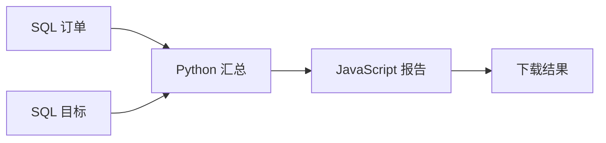

# 不再早起 · Sleep In

**把早班交给工作流，把清晨留给自己。**

面向复杂定时任务的可视化低代码平台。

[English](README.md) · 简体中文

[](https://github.com/haowenchen0811/sleep-in/actions/workflows/ci.yml) · [MIT 许可证](LICENSE)

不要因为周一早上开周会，就得早起拉数据。把整条准备流程提前搭好，周日晚上继续玩，让电脑到点准备好报告。

单个脚本定时执行，可能并不需要这个项目。真正复杂的是：先查两个数据库，选出要传递的字段，交给 Python 汇总，再交给 JavaScript 生成报告；环境不一样，步骤之间有依赖，失败后还得知道卡在哪里。**让这些流程可以复用、看得见、查得清，才是“不再早起”的意义。** 搭建和执行流程不依赖 AI 服务，也不需要另外注册 n8n 账号。



项目独立编写。n8n 执行已发布的依赖图；不再早起负责可视化编辑、输入输出契约、运行环境、定时表单和运行记录。

> 开发预览版。[验收记录](docs/testing/COMPLETE-RESULTS.md)区分已实现及测试的软件功能，与干净 Mac、签名分发、真实电源状态的发布闸门。原生脚本用于可信管理员代码，不是陌生代码的安全沙箱。

## 可以做什么

- **流程结构编辑**：节点列表直接编辑、复制、删除；连线中间插入步骤，新增分支、更换起点／终点或节点类型，均可撤销。
- **固定向下编排**：点击添加节点，按依赖自动排列，分支左右展开；底部输出连接顶部输入，保留平移缩放和结构编辑撤销，不允许自由拖动节点。
- **按语言分类**：SQL、Python、JavaScript、Shell、Java、C、C++。SQL 再细分 SQLite、PostgreSQL、MySQL、Oracle。
- **明确传值**：选择上游字段、固定值、流程参数、文件或凭据作为输入。只连执行顺序，也可以完全不使用上游输出。
- **运行与排错**：分支汇合、独立节点试跑、安全步骤重试、取消、逐次日志及完整结果下载。
- **运行环境**：构建不可变版本，上传单文件或 ZIP 项目，执行前准备依赖和编译结果。
- **普通人能用的定时**：单次、每天、工作日、每周、每月、间隔，选择时区并预览后续时间，无需 Cron 表达式。
- **日常管理**：邮件/机器人通知、数据保留、加密备份、旧任务迁移。
- **英文优先**：可切换简体中文，保留未保存的输入和画布。

## 在 Mac 上开始

支持 Apple silicon、macOS 13 及以上。安装器下载独立的 Python、Node、n8n 环境；首次需要联网和数 GB 可用空间。无需 Docker，也无需租服务器。

```sh
git clone https://github.com/haowenchen0811/sleep-in.git
cd sleep-in
./launch-mac.command
```

源码启动器会打开终端；原生 **Sleep In.app** 提供无终端安装进度和菜单栏状态。当前本地构建为临时签名，尚不宣称已有正式公证安装包。[Mac 安装说明](docs/MAC.md)

1. 使用全新本地登录页展示的 **admin / sleepin123456** 登录；可在“账户”修改密码。
2. 打开“模板 → 引导设置”，选择运行时间与时区。
3. 点击“测试并启用计划”；完整示例成功后才会启用定时。

示例使用虚构 SQLite 订单，不需要公司数据或数据库账号。随时进入可视化编辑器扩展流程。其他语言与依赖在[运行环境](docs/RUNTIME-API.md)配置。

## 安装一次，每天继续运行

后台在每日任务之间持续运行，包括电池供电。关网页、今天任务结束、暂停计划，都不会主动关闭后台。原生应用提供需要 macOS 同意的“登录时启动”，停止时可选择等当前任务完成或取消。

后台持续申请防止空闲系统休眠，允许锁屏和熄屏；它不能覆盖合盖、主动休眠、关机、过热或电量耗尽。我们要的是持续后台服务，不是承诺关机以后还能运行。插电、电池、锁屏与跨夜运行分别属于需要真实记录的验收。[电源行为及测试边界](docs/MAC.md)

**一键部署，一键运行，一键安心睡觉。**

## 可选 Docker 部署

```sh
docker compose up -d --build
docker compose exec web python -m taskconsole setup-token
```

打开 [localhost:8080](http://localhost:8080)，用一次性令牌创建管理员。Docker 模式不使用公开默认密码。Compose 包含可视化工作流执行服务，并保留旧任务调度器用于迁移；同样可以从引导模板开始。运行计划期间需保持 Docker 启动。

[CI](.github/workflows/ci.yml)验证全新 Compose 部署、实际 n8n 定时流程和精确输出内容。配置了测试不等于测试已通过，请查看对应提交的执行结果。

## 文档和开发

| 内容 | 文档 |
| --- | --- |
| 产品与验收标准 | [中文 PRD](docs/PRD.zh-CN.md) · [English](docs/PRD.md) |
| 先于开发设计的测试 | [测试方案](docs/TEST-PLAN.zh-CN.md) · [验收结果](docs/testing/COMPLETE-RESULTS.md) |
| 输入输出、重试、触发、文件 | [执行契约](docs/EXECUTION-API.md) |
| 环境与源代码项目 | [运行环境 API](docs/RUNTIME-API.md) |
| 通知、备份、迁移 | [运维 API](docs/OPERATIONS-API.md) |
| 数据库真实验证 | [SQL 矩阵](docs/testing/external-sql-matrix.md) |
| 参与贡献 | [Contributing](CONTRIBUTING.md) · [Security](SECURITY.md) |

```sh
python -m venv .venv
. .venv/bin/activate
pip install -r requirements-dev.txt
python -m pytest -q -ra
```

集成测试需显式配置 n8n、工具链和数据库；跳过不计为通过。本项目原创代码采用 [MIT](LICENSE)，n8n 等依赖保留各自的许可证。
