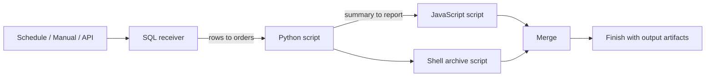
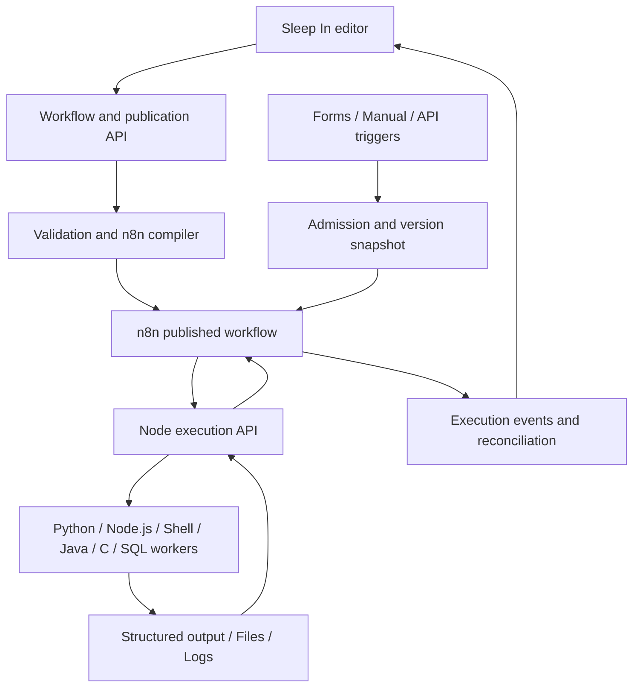

# Sleep In — Workflow platform PRD v2

English · [简体中文](PRD.zh-CN.md)

**Status: implementation and integrated verification.** This specification governs the visual workflow release. The current implementation includes the execution, runtime, editor and operations layers; release acceptance is tracked individually in [completion evidence](testing/COMPLETE-RESULTS.md). Hardware, clean-Mac and distribution gates remain distinct from automated code tests.

## 1. Product definition

**A visual, drag-and-drop low-code platform for complex scheduled workflows.** Connect SQL receivers and multilingual scripts, map upstream outputs into downstream inputs, coordinate dependencies and branches, then schedule the whole published workflow.

A single script or an AI-scheduled action can cover a single task. Sleep In earns its place when work spans multiple data sources, languages and dependent steps that need a reusable graph, consistent inputs, failure handling and a visible execution history. AI is optional assistance, not the scheduler, workflow definition or runtime dependency.

Workflow authors configure code, connections and environments. Everyday users choose a published workflow or template, supply parameters, select a schedule and inspect results. They should not need to learn the n8n editor, Cron or internal execution protocols. The Mac companion owns service startup and readiness; everyday users should not manage infrastructure.

- Brand: Sleep In / 不再早起. Start in English; explicitly switch to Simplified Chinese before or after sign-in. Preserve unsaved inputs, graph state and time semantics when switching.
- Independent editor and runtime management, with n8n orchestrating the actual graph rather than only sending scheduling heartbeats.
- The node library contains **SQL receivers and language scripts only**. No DeepModel, reconciliation, finance-model or other business-specific filler nodes.
- Business transformations, reconciliation and reporting belong in user-authored SQL or scripts.
- Upstream results are explicit, typed and inspectable downstream inputs.
- Scheduling uses ordinary form controls. No Cron input, including an advanced Cron editor.
- Interpreted and compiled languages are first-class runtime configurations from the initial data model.
- Templates use synthetic data; never import private predecessor code, employment text, business configuration or credentials.

## 2. Reference interpretation

The supplied screenshots establish functional references, not a visual theme to copy.

| Reference | Preserve | Redesign |
|---|---|---|
| Graph and outline | Connected steps, outline, save, publish | Horizontal canvas, language/runtime labels, separate draft and published states |
| Node menus | Search and insertion | Language and SQL dialect grouping; remove query/transform/service/control top-level tabs |
| API trigger | External invocation | Authentication, input schema, idempotency and asynchronous run status |
| Scheduled trigger | Enable/disable and preview | Frequency, calendar controls, timezone, bounds and next five occurrences |
| Email/robot errors | Final-failure notification | Shared channels selected in workflow settings, with explicit test recipient |
| Execution settings | Run name, timeout, logs, cleanup | Separate execution policies and retention with clear defaults |
| Python settings | Shared dependencies/code | Versioned multilingual runtime center, including compilation |

Use one collapsible navigation panel rather than stacked sidebars. Do not replicate the reference's purple controls, narrow flyouts or business-specific filler catalog.

## 3. Navigation and objects

Primary navigation: **Workflows, Runs, Connections, Runtimes, Templates, Settings**. Account settings live in the avatar menu. Workflow detail has **Editor, Triggers, Runs, Settings** tabs. Reusable scripts remain accessible through workflow authoring and templates rather than dominating the product navigation.

| Object | Responsibility |
|---|---|
| Workflow | Identity, description, tags, owner, triggers and current publication |
| WorkflowVersion | Immutable graph, contracts, scripts and runtime versions |
| Node | Stable ID, display name, language/dialect, bindings, outputs and error policy |
| Edge | Dependency and output-to-input reference using stable IDs |
| ScriptVersion | Reusable source/project, entrypoint and input/output schema |
| RuntimeProfileVersion | Language/toolchain, image digest, locked dependencies, modules, build/run rules and limits |
| Connection | Typed endpoint and secret reference; no secret values in exports |
| Trigger | Manual, scheduled or API; parameters, version selection and admission policy |
| WorkflowRun / NodeRun | Version snapshot, input references, status, attempts and logs |
| Artifact | File/dataset identity, checksum, media type, size and retention |

Triggers follow the current published version by default; administrators may pin a version. Admission freezes the version and non-secret parameters for each run. Credentials are resolved with authorization at execution time; record the credential revision identifier without copying secret values into snapshots.

## 4. First useful journey

Start Compose, create an administrator, choose the Morning report template, and see SQL → Python → JavaScript. The default template uses a bundled SQLite synthetic dataset, without external accounts. Real database connections are optional replacements.

Select `Order query → rows` as the Python node's `orders` input. Map its `summary` to a JavaScript input. Test the workflow, inspect each node's data/logs and download the resulting file. Publish a version, choose weekdays at 07:30 in Asia/Shanghai, inspect the next five occurrences and enable the schedule.



## 5. Node library

| Category | Variants | Configuration |
|---|---|---|
| Python | File, ZIP project, published script | Interpreter profile, entrypoint, dependencies, input/output |
| JavaScript | Node.js file, npm project, published script | Node profile, ESM/CJS and lockfile; no browser DOM assumptions |
| Shell | Bash, POSIX sh; later PowerShell | Interpreter, tools, arguments, files and exit status |
| SQL receiver | PostgreSQL, MySQL, SQLite, Oracle; later more dialects | Typed connection, SQL mode, bindings and result schema |
| More languages | Java, C, C++, custom runtime | Compiler/toolchain, build entrypoint, executable and shared protocol |

A SQL receiver accepts workflow parameters or upstream data, executes SQL through a typed connection, then exposes structured results downstream. Query and write are modes inside the receiver, not additional top-level business categories. Java/C/C++ can be pinned to the library home and found directly by search.

Branch and merge are canvas wiring tools, not business catalog categories. Triggers are configured from the start card. HTTP calls are implemented in scripts; files come from output contracts; notifications belong in workflow settings.

Click language nodes to add them. Arrange every graph automatically from top to bottom by dependency depth, with parallel branches side by side and merges below all predecessors. Disable free node dragging, keyboard repositioning and horizontal layout. Only a centered top input and bottom output are available; connect them and choose fields to map data. Also support insertion, duplication, deletion, undo/redo, layout, zoom, fit, selection and outline search. Duplicates get new IDs. Deleting a referenced node exposes broken mappings and blocks publication. Only directed acyclic graphs are supported initially.

## 6. Editor and visual direction

A light, restrained workspace retains Sleep In's forest-green accent. The canvas is the primary surface; do not surround it with decorative dashboard cards.

| Area | Design |
|---|---|
| Top bar, about 64px | Name, version, draft/publication, save status; Test, Save draft, Publish |
| Left panel, about 240px | Library/Outline tabs, search, language tree; collapsible |
| Canvas | Light dot grid, fixed downward dependency layout; centered top input/bottom output, directional arrows and obstacle-aware routes; branches expand sideways automatically |
| Inspector, about 380–440px | Opens on selection; Configuration, Inputs, Outputs, Environment, Error policy |
| Bottom run drawer | Collapsible timeline, logs, JSON/table/file previews |

Cards approximately 220–260px wide show language/dialect, business name, runtime, port counts and, during execution, status/duration. Use short binding labels on edges. Selection has a clear green outline. Error and other states need icons/text, not color alone.

Design tokens: background `#F6F8F7`, white panels, text `#20382B`, secondary text `#617568`, accent `#16835D`; 14px body, 12px labels, 20–24px titles, 8/12/16/24px spacing and 8–10px radii. Use a consistent licensed icon library. Offer a light/dark code editor without forcing a dark application.

Empty workflows offer a first node or template. Missing environments show readiness and a repair path. Failed runs focus the affected node. At 1280px and above show both panels; at 1024–1279px open one panel at a time. Phones prioritize inspection, schedule toggles and simple parameters; full mobile graph editing is not an initial promise. Provide keyboard alternatives through the outline and input-source lists, with defined modal/drawer focus behavior.

## 7. Data mapping and contract

Edges establish execution dependencies independently of input mappings. A connected node may use constants/parameters or no inputs at all; no upstream output is injected automatically. Required predecessor failure still blocks it. Optional missing data and an explicitly optional dependency are different policies. See the [test contract](testing/contract-decisions.md).

Inputs use a **Target field / Source / Example value** table. Sources: constant, workflow parameter, upstream output, credential reference or execution context. Users choose from a field tree; arbitrary expression code is not required or executed by the initial mapper. Only reachable upstream outputs are allowed. Choosing another source first establishes a valid dependency.

Show which test run produced an example and mark stale samples. Display names do not affect bindings. Historical samples must not silently become production inputs.

Each node consumes one named input object and produces one output object. A table is an array or dataset reference inside that object. **Do not implicitly run the next script once per row.** Explicit per-item processing is later scope.

```json
{
  "schemaVersion": 1,
  "data": {
    "summary": {"count": 128, "amount": "9200.50"},
    "rows": [{"order_id": "A001", "amount": "10.50"}]
  },
  "artifacts": [
    {"id": "artifact_demo", "name": "report.txt", "mediaType": "text/plain"}
  ]
}
```

JSON is the shared representation. Dates use timezone-qualified ISO strings; high-precision decimals and integers outside JavaScript's safe range use schema-marked strings. Native DataFrames, Java objects and binary buffers are not portable payloads. Tables declare column names, logical types and nullability. An empty query returns `rows: []` successfully.

Initial default limits: 1 MiB inline output per node; 100 MiB and 100 artifacts per node, configurable by administrators. Larger structured output must use a complete dataset/file reference. Previews paginate and must never silently truncate the actual downstream data. stdout/stderr are logs, not structured outputs.

Processes receive `SLEEP_IN_INPUT_FILE`, `SLEEP_IN_OUTPUT_FILE`, `SLEEP_IN_ARTIFACT_DIR` and execution identifiers. Python/JavaScript get lightweight helpers; Shell/Java/C/C++ can use the same JSON file contract directly. Nodes without declared outputs may return success only. Missing required outputs produce output-validation failure even if the process exits zero.

Artifacts resolve to authorized node-local paths rather than passing an upstream machine's absolute paths. Preview/download permissions follow workflow access. Mask known secrets; do not promise detection of every secret a script deliberately prints.

### Branch and merge semantics

- Fan-out supplies read-only snapshots. Independent edges allow concurrency but do not prove n8n runs branches simultaneously; actual concurrency must be validated for the execution adapter.
- Multiple upstreams require an explicit merge. Default: wait for all activated inputs, preserve named sources and avoid implicit row-position joins.
- Unselected paths are skipped, not failed. The compiler emits completion/skipped markers so merges terminate. Do not assume a native n8n Merge alone implements this contract.
- A failed required input blocks downstream execution. Optional inputs may use explicit defaults and yield a partial outcome.
- Initially support named merges and explicit array append. Relational joins remain SQL/script logic. Loops, subflows and per-item fan-out are later phases.

## 8. SQL receivers and connections

Choose a database dialect, then a matching connection. Separate connection configuration from code and runtime profiles. Connections include endpoint, database/service, TLS, authentication, connection testing, credential updates and allowed workflows. SQLite uses managed storage rather than arbitrary host paths.

Provide dialect templates, bound parameter lists, schema and limited previews. Bind values through drivers; do not interpolate input into SQL strings or arbitrary identifiers. Default to query mode with database-enforced read-only credentials/session, not a naive SELECT-prefix check. Write mode requires a write-capable connection and visible impact information.

Transactions are per SQL node; supported writes commit on success and roll back on failure. Do not promise rollback across nodes/databases or conceal dialect-specific implicit commits. Outputs: rows, columns, rowCount, and affectedRows for writes. Provide query timeout and result limits with full dataset exports.

The first Oracle target is a tested Thin connection path. Extra-client/wallet/older-server requirements are runtime extensions, not automatically supported configurations. Do not redistribute restricted clients. Publish a tested database/driver/platform matrix.

## 9. Runtime center

Workflow-level defaults are per language and overridable per node. Multiple languages in one graph do not share one implicit Python environment.

| Runtime | Build and execution model |
|---|---|
| Python | Version, locked pip dependencies, shared modules and entrypoint; build at publication, reuse at execution |
| JavaScript | Node version, npm lockfile, ESM/CJS and shared modules; asynchronous entrypoints supported |
| Shell | Explicit macOS or Linux Bash/sh profile and available tools; JSON/argv input instead of command-string interpolation |
| SQL | Dialect/driver and optional client profile, separate from connection secrets |
| Java | JDK, main class, source/JAR and Maven/Gradle configuration; compile at publication |
| C/C++ | Compiler, language standard, sources, link dependencies and executable; compile at publication and record architecture |
| Custom | Admin-registered language ID, immutable native-runtime or image digest, build/run argv and protocol conformance |

Shared code is a module/library/file appropriate to the language. Do not prepend Python to every node. Keep variables and credentials separate. Environment updates create new versions; published workflows retain old versions until revalidated and republished. Source, dependency and environment changes invalidate build caches.

Environment states: Draft, Building, Ready, Failed. Show toolchain, dependency summary, build logs and referencing workflows. An unavailable environment blocks publication with an actionable explanation.

Use managed working directories, timeouts and output quotas. Report actual per-platform CPU/memory enforcement capabilities; do not imply native macOS processes have container-level controls. Separate language worker services from the web/n8n process. Docker profiles do not give web/n8n a Docker socket; custom native packs or container images use an owner-controlled installation path. This remains a trusted workspace, not a hostile-code hosting service.

## 10. Scheduling and triggers

A workflow can have multiple named manual, scheduled and API triggers, each with parameters, status, publication choice and admission policy. Only a published workflow with ready environments can enable scheduled/API triggers.

| Schedule | Controls |
|---|---|
| Interval | Positive count, minutes/hours and an explicit anchor |
| Daily | One or more times |
| Weekdays | Monday–Friday and time, explicitly excluding holiday adjustment |
| Weekly | Selected weekdays and times |
| Monthly | Day 1–31 or month-end and time; missing dates skip by default |
| Once | Date and time; complete the trigger after execution |

All forms specify timezone, start and optional end. Show a natural-language summary and next five occurrences with timezone. Preview and dispatch share a calculator. DST gaps skip; repeated wall times use the first occurrence. No UI or new public API requires or offers Cron expressions. Internal representation must not leak into user setup.

API admission validates authorization, schema and publication, persists a run, then returns HTTP 202 and a run ID. It is not execution success. Support request idempotency and asynchronous status lookup. Do not expose demo trigger endpoints to the public network by default.

Default overlap policy skips new triggers while a workflow is active, with a recorded reason. An advanced bounded sequential queue may be selected. Offline occurrences are skipped rather than replayed in a burst.

## 11. Drafts, tests, publication and runs

Save draft accepts incomplete configuration and exposes validation errors without implying readiness. Node tests use explicit sample input or a chosen historical snapshot; they never rerun upstream steps implicitly. Tests involving SQL writes, Shell or external calls can have real side effects and must not be described as harmless simulations. Formal notifications are off for tests by default.

Workflow tests execute an immutable temporary snapshot of the current draft and are marked separately from published runs. Publication validates acyclicity, required fields, reachability, schemas, environment builds, connection authorization, merge semantics and resource limits. Errors link to the affected node. Successful publication freezes a version. A previously successful connection test does not guarantee future availability.

Node states: not_run, queued, running, succeeded, failed, skipped, cancelled, timed_out. Workflow states: queued, running, succeeded, failed, partial, cancelling, cancelled, timed_out. Success requires all required work and output collection to complete.

Inspect node inputs, outputs, build/run logs and error reasons. Every retry has a separate attempt record. Initial delivery supports full workflow reruns; resuming from a failed node requires a later verified recovery mechanism, retained upstream snapshots and the same version. Never substitute another run's data after an output expires.

Administrators manage connections, runtime installation, source publication, users and instance policies. Operators can use authorized published workflows, manage their allowed triggers and inspect authorized runs. Source modification, runtime changes and secret retrieval are not implied by run permission. Keep server-side checks, session revocation and write-only credential management.

## 12. Notifications and execution policies

Notifications live in workflow settings, not as business nodes. Initial channels: email and generic webhook; provider presets for DingTalk, Feishu and WeCom are configuration templates requiring the owner's account. Off by default, no external account required for demos.

Select final failure, timeout, recovery and optionally success, with explicit recipients/channels. Send workflow/run/node identifiers, time, a masked error summary and a detail link; omit raw business data and full logs by default. Test sending displays its target. Notification delivery failure is recorded independently and does not restart business steps.

Run names use selectable workflow/date/parameter fields with a preview. Nodes and workflows have separate timeouts; nodes cannot exceed the remaining workflow deadline. Business automatic retries default to zero; users may opt into bounded retries and delays. Warn about idempotency on side-effecting steps. Stopping execution does not undo external changes.

Default logs/data retention: 30 days; metadata: 90 days. Allow separate success/failure policies and show what will be removed. Active runs and their referenced artifacts are protected; retry dependencies extend retention. Record cleanup outcomes. Reconciliation after restart restores known state; uncertain side effects require inspection rather than blind replay.

## 13. Architecture and n8n responsibility

Choose an independent workflow model/editor compiled into real n8n workflows, with external language workers. Alternatives are direct exposure of the n8n editor, which makes the specified UX difficult, or a new proprietary DAG engine, which duplicates orchestration and departs from the chosen n8n direction.

The application owns definitions, publication, schedule calculations, authorization and user-facing state. n8n owns node dependencies and execution order. Workers execute scripts/SQL and collect output. A scheduling wake-up mechanism may remain, but it starts a complete n8n graph rather than directly running one Python task.



Each logical node compiles to an identifiable n8n node group. Long jobs use submit/wait/result rather than an indefinitely open HTTP request. Pass small envelopes and artifact references. Compile branch completion/skipped markers and error paths explicitly; integration-test deviations from n8n's native merge behavior.

Database constraints protect admission. `run_id + node_id + attempt` is the submission idempotency key. Duplicate n8n starts must claim one authoritative execution lease at the graph entrance; losing executions cannot proceed. The orchestration layer alone owns business retry decisions; workers do not retry independently.

Cancellation prevents new dispatch, propagates to active workers and becomes final only after termination is confirmed. Events are ordered/deduplicated so late running events cannot overwrite terminal states. Administrators may inspect associated n8n/worker IDs, but users need not understand them.

Before implementation, verify publication/activation, authenticated starts, wait recovery, cancellation, branch joins, artifacts, duplicate starts and restarts against the pinned n8n version. Do not assume current documentation matches every API in the existing pinned deployment, or treat undocumented internal APIs as stable integration.

## 14. Mac-first setup, low-code use and delivery

### 14.1 Why Sleep In exists

A Monday morning meeting should not cost you your Sunday night. Prepare the workflow once, let your Mac collect and process the data, and wake up to the results. **One-click setup. One-click run. Sleep in.** The promise is fewer chores and clearer readiness, never guaranteed execution on a powered-off computer.

The primary user owns a MacBook, not a server. The default journey is **install with background service → drag nodes or open a template → map inputs/outputs → test and publish → pick a schedule**. A working synthetic weekly-report template is available before connecting a real database. The visual graph editor is the primary authoring surface; templates provide ready-made graphs that remain editable. Writing code and configuring runtimes are optional advanced paths. Template fields use ordinary labels, sample values, sensible defaults and inline validation; selecting an upstream field requires no expression syntax. Advanced settings stay collapsed. The schedule is a sentence such as “Every Monday at 7:00 AM, America/Chicago”, not Cron.

Product acceptance targets: no Terminal commands for the packaged Mac path; no separate n8n account, server, Docker, Python or Node installation; after installation, complete the sample in at most three product screens (template, time, readiness). Data-source authentication is an explicit extra step when needed. Measure setup completion and user mistakes before making time-saving claims.

### 14.2 Installation and background ownership

Preferred delivery is a signed and notarized **Sleep In.app**, with a Mac menu-bar companion and localhost web interface. Target macOS 13+ on Apple silicon first; Intel support is advertised only after a separate packaged-build test. The app manages version-pinned Node/n8n, Python, language workers and private local storage. Downloads show size/progress, verify integrity and resume after failure. An offline synthetic example works after dependencies are installed. Network data sources still need their network or VPN.

Use a native-process local profile with SQLite storage and a single coordinator; verify both application admission and n8n persistence on this profile. Workers run as the signed-in user in app-managed environments. This is for trusted local scripts, not an OS security sandbox. Record platform/architecture in every runtime and artifact; Linux-only templates cannot silently run on macOS. Keep Docker Compose as the optional developer/server profile with PostgreSQL and container workers. They must share the workflow contract, not pretend to have identical isolation or dependency behavior.

Installation checks OS, architecture, disk space and local port availability. Launch one service supervisor, wait for actual application/worker/n8n health, then open the browser. Repeated launch opens the existing instance instead of starting another scheduler. Offer **Retry**, **View details** and **Open app** instead of command-copy instructions. Updates back up configuration and stop admission before switching; failure rolls back without starting a second scheduler. Preserve data on uninstall unless explicitly selected for deletion.

Register the background/login helper with `SMAppService`. Show why it is useful and its real status; where macOS requires approval, open the relevant System Settings page and wait for the user's action. A website alone cannot grant this permission. Closing a browser window keeps the helper running; **Quit Sleep In** stops it and clearly states scheduled tasks will pause. After reboot, service recovery starts after the user logs in; do not promise unattended execution before FileVault unlock. Do not disable system protections or request Accessibility/Full Disk Access merely to run schedules.

### 14.3 Visible default login for the local edition

On a **fresh local installation only**, initialize the administrator as `admin` with the public initial password `sleepin123456`. The login page shows both values in a clearly labelled **Default local account** card with **Use default account** and a short link to **Account → Change password**. English is initial; Chinese is available on this page. Timezone is detected and shown for confirmation without a setup token or command.

This card appears only while that installation still uses its initial credentials. Changing the password hides the card, revokes existing sessions and does not reveal the new password anywhere. Existing installations, migrated users and restored accounts are never reset or given an extra default administrator. Recovery is an explicit local-owner action. Bind the local edition to loopback and validate Host/Origin; do not publish default credentials through a non-loopback/proxied bootstrap response. A deliberate LAN/server deployment requires a new private password and removal of the public-default mode before listening externally. The current v1 setup-token path remains documented until this new path is implemented.

### 14.4 Always-on background service, including battery power

**Installation/deployment starts the background service by default, after any necessary macOS approval.** Persist this choice and start at user login. No separate nightly “Sleep in” click, AC requirement or currently enabled task is needed to keep the service running. “Sleep in” describes the product promise; the primary workflow actions remain **Test, Publish, Schedule**. The home and menu bar show **Background running**, health and the next scheduled workflow.

Treat service lifetime, scheduled execution and sleep prevention as separate states. The service stays alive with zero workflows or all triggers paused, without executing disabled work. While the default always-on mode is enabled, hold an idle-system-sleep assertion on **both AC and battery**, across all waiting periods and executions. Unplugging must not stop the helper, remove the assertion, pause triggers or require another click. Finishing a daily/weekly run does not end the service or protection. No morning cutoff or temporary-session mode is required for the initial release.

Allow the display to turn off and lock normally; do not permanently alter global power settings. Show power source and battery level as information, not an activation gate. Explain during setup that keeping the Mac awake also consumes battery between tasks. Low battery produces an alert without an application-imposed automatic pause or silent switch to AC-only operation. Respect macOS critical-power, thermal and explicit sleep/shutdown decisions; never promise unlimited battery life or bypass OS protections.

At startup/login and after a crash, the supervisor restores the stored running preference, rechecks n8n/application/worker health and reacquires the assertion. A single-instance lock prevents duplicate schedulers. A crash releases the old process's assertion; record the gap instead of claiming uninterrupted service. Power-source changes update status without restarting services. Health checks never perform database writes or other business side effects. Test synthetic inputs first; real connection tests assess only current reachability.

Closing the browser or application window keeps the background service running. **Pause workflow** stops only that workflow's future admission; **Pause all schedules** keeps the service and default power protection running. An explicit **Stop background service / Quit completely** releases protection and stops admission, with a clear explanation; preserve this choice across login/restart until the user selects **Start background service**. Removing background permission or uninstalling also stops the helper. Do not silently restart after an intentional stop. Active executions use a visible finish-or-cancel choice before full stop; cancellation must be confirmed before reporting stopped.

| State | Required behavior |
|---|---|
| Plugged in or on battery | Same service, scheduling and idle-sleep-prevention behavior; no extra switch needed |
| AC disconnected/reconnected during a run | The same run continues; no duplicate, restart or protection gap caused by the power transition |
| Screen locked/display off | Service, admission and workers continue while the system stays awake |
| No enabled workflows | Service remains available with the always-on assertion; show no upcoming runs and avoid busy polling |
| Lid closed or explicit system Sleep | Cannot guarantee execution; do not claim idle-sleep prevention overrides these actions |
| Battery exhausted, power off or logged out | No execution guarantee; recover after power is available and the user logs in |
| Network/VPN unavailable | Keep the service alive; local jobs can proceed, affected workflows follow failure policies |

On wake/restart, show missed occurrences and reasons. Default: skip with a visible record; optionally run the latest missed occurrence once within a configurable grace period (default 2 hours). Do not replay a backlog or duplicate a write with an uncertain result. Next future occurrences remain enabled. Optional notifications request permission only when enabled. “24/7” means continuous intended operation on a powered, OS-running Mac; it is not an uptime SLA or a claim that software executes after shutdown. Closed-display external-monitor setups are outside the initial guarantee.

### 14.5 Release gates

Java and C/C++ remain first-release targets as optional, verified runtime packs. Show **Install runtime** with download size, license/OS prompts where applicable, progress and a real execution self-test; default users should not install every compiler. Custom environments are an advanced owner-managed path. A node cannot publish until its runtime is ready.

| Phase | Deliverable and gate |
|---|---|
| A: Mac vertical slice | Packaged local launch, visible fresh-install login, synthetic SQLite → Python → JavaScript workflow, typed mapping, real n8n execution, artifacts, form schedule, bilingual UI and persistent schedule protection |
| B: complete initial release | Python/JS/Shell; tested SQL dialects and optional Java/C/C++; publication, branching/merging, notifications, cancellation/recovery; signed distribution, upgrades and Mac power-state evidence |
| C: extensions | More platforms/languages/databases, iteration, subflows, checkpoint recovery and measured scale improvements |

Do not advertise a one-click Mac release until a clean Mac without developer tooling can install it and finish a locked-screen scheduled run. Measure actual system sleep separately from a lock-screen screenshot. Oracle, Java and C/C++ require real platform-specific execution evidence. No business-specific filler nodes, SaaS billing or plugin marketplace.

## 15. Migration

Convert a v1 task to Start → Python → Finish, retaining script version, parameters, timezone and historical linkage. Convert supported form schedules without semantic changes. If an old Cron schedule cannot be represented precisely, keep its migrated trigger disabled and request a new form selection; retain the original only in migration records, not a new Cron editor.

Migration creates disabled triggers for review. Stop old dispatch before enabling replacements to avoid duplicate execution. Existing runtime environments require a verified rebuild; do not relabel them as isolated runtimes. Back up and verify recovery before switching. Keep v1 implementation evidence separate from v2 design claims.

## 16. Acceptance criteria

| ID | Observable result |
|---|---|
| A01 | English-first; Chinese switching preserves graph, inputs, mappings and time semantics |
| A02 | SQL dialect selection and language-only business node catalog; no filler model/reconciliation nodes |
| A03 | Three SQL rows reach Python intact; its summary reaches JS; each logical step runs once |
| A04 | Missing/type-incompatible/unreachable fields fail validation; empty query results remain valid arrays |
| A05 | Oversized output passes as complete artifacts, never a truncated preview |
| A06 | Renaming keeps bindings; deleting a source reveals affected mappings and blocks publication |
| A07 | Python/JS/Shell execute; Java/C/C++ compile and exchange JSON; build failures block publication |
| A08 | Real PostgreSQL/MySQL/SQLite/Oracle checks cover bindings, nulls and write transactions, with version evidence |
| A09 | Skipped branches do not deadlock merges; required failures block downstream; optional defaults are explicit |
| A10 | Forms cover once, weekdays, month-end, absent dates, DST and timezone; no Cron editor |
| A11 | New publication/environment versions do not mutate admitted or historical executions |
| A12 | Duplicate admission/submission does not repeat work; cancellation and restart preserve side-effect boundaries |
| A13 | Notifications use configured recipients, fail independently and stay off for test runs by default |
| A14 | Template exports omit secret values, real connection endpoints and historical data; imports rebind environments/connections |
| A15 | Desktop, keyboard, bilingual long text and narrow-screen reading are checked separately; no page-wide overflow |
| A16 | Clean Compose executes an actual n8n graph and scheduled occurrence with node/version/artifact evidence |
| A17 | A clean supported Mac completes installation and a sample without Terminal, Docker or separately installed language tools; repeated launch never duplicates services |
| A18 | Fresh local login displays working initial credentials; password change hides them and revokes sessions; existing/restored users are not reset; external mode refuses public defaults |
| A19 | On AC and battery separately, a locked/display-off Mac executes scheduled workflows; verify the assertion and power source, not just screenshots; closing either window keeps services alive |
| A20 | Consecutive daily occurrences run without another click; switching AC/battery during a run causes no interruption or duplicate; login restores default services, explicit stop remains stopped; missed recovery avoids duplicate writes |
| A21 | Background permission accepted/denied/revoked paths work; post-login restart, signed installation, update rollback and timezone changes are tested on each advertised Mac target |
| A22 | A novice completes the synthetic template through at most three post-install screens; a separate authoring test drags two SQL sources into Python then JS, maps outputs, previews the run and publishes a form schedule without expression syntax or AI |
| A23 | Zero/paused workflows keep services alive; explicit full stop, crash and revocation release assertions correctly; default launch needs no separate protection click; test an AC overnight soak and measured battery sessions spanning multiple occurrences |

Initial design budget: a 50-node workflow, not a measured performance claim. Test 10/25/50-node and branching graphs before defining a supported limit.

## 17. Evidence and outstanding verification

Official documentation confirms JavaScript/Python Code nodes. It does not establish native Java/C execution. Execute Command runs inside the n8n container when deployed with Docker and is disabled by default starting in n8n 2.0. This supports choosing separate language workers. [Code](https://docs.n8n.io/integrations/builtin/core-nodes/n8n-nodes-base.code/) · [Execute Command](https://docs.n8n.io/integrations/builtin/core-nodes/n8n-nodes-base.executecommand/)

The editor, file contract, compilation cache, admission mechanism and branch markers are implemented in Sleep In. Their behavior is tested against the pinned n8n version; n8n alone does not provide these application contracts. [Merge](https://docs.n8n.io/integrations/builtin/core-nodes/n8n-nodes-base.merge/)

The target remains independently self-hosted personal/internal workspaces. Original Sleep In code and the n8n dependency retain separate licenses. Future paid hosting or customer-facing embedding requires a use-case-specific license review; a custom UI does not itself remove dependency licensing obligations. [Official license explanation](https://github.com/n8n-io/n8n-docs/blob/main/docs/privacy-and-security/sustainable-use-license.md)

Use the acceptance ledger for current evidence. A configured test or implemented API does not close a real-hardware release gate.

Apple documents that an idle-system-sleep assertion allows display sleep but does not prevent lid-close, explicit sleep or low-battery sleep. The design therefore supports both AC and battery while limiting its guarantee to an awake, powered system; continuous battery runtime must be measured, not assumed. [Apple power assertion](https://developer.apple.com/documentation/iokit/kiopmassertiontypepreventuseridlesystemsleep). Background registration may require user approval; the Mac helper must check status and guide that action. [Apple service registration](https://developer.apple.com/documentation/servicemanagement/smappservice/register%28%29). Signed packaging, native runtime compatibility, storage concurrency and power-state behavior remain release tests, not completed capabilities.

## Interaction amendment — 2026-09-17

Position never determines execution order. A user may place downstream nodes above, below, left or right. Each side has distinct filled output and hollow input ports; arrows end outside the target port, preventing overlap. Routes avoid unrelated cards; moving nodes, panning or cursor-centered zoom changes presentation only. Selecting a connection exposes source, target and mappings in a separate panel. Horizontal and vertical auto-layout are optional and undoable. A dependency may carry no data; only explicit input bindings transmit values.

## Interaction revision — 2026-09-18

Fixed downward layout supersedes earlier free-placement requirements. Existing saved coordinates are reflowed on editor load without changing dependencies, source code, mappings or publication. Node addition, duplication, connection, deletion and undo/redo keep the layout derived from the graph. Panning/zooming only move the view. Adding a node never invents a dependency or input binding.
