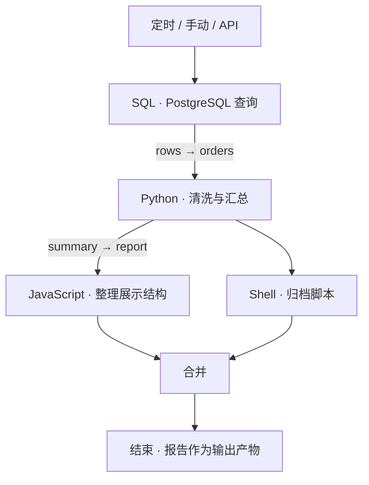
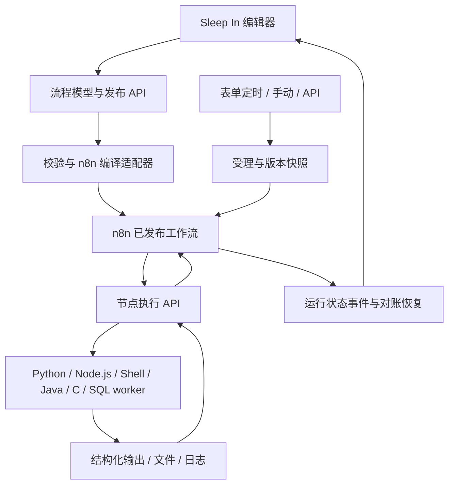

# Sleep In · 不再早起 — 工作流平台 PRD v2

[English](PRD.md) · 简体中文

**状态：已进入实现与集成验收。** 本稿是可视化工作流版本的验收基准。执行引擎、运行环境、编辑器与运维功能已进入集成验证；逐项结果见[完整验收记录](testing/COMPLETE-RESULTS.md)。真实电源状态、干净 Mac 与正式分发的验收不能用代码测试代替。

## 1. 产品定位与设计原则

**固定向下排列的可视化低代码平台：把 SQL 接收器和多语言脚本组织成复杂工作流，映射上下游输入输出，协调依赖与分支，定时执行整条已发布流程。**

单个脚本或交给 AI 安排一次定时，已经能解决单一任务；本项目的价值在于多个数据源、不同语言和相互依赖的步骤，需要一张可复用、可检查、可处理失败、可追踪运行的流程图。AI 可以辅助写脚本，但不是调度器、流程定义或运行前提。

面向两类用户：流程作者负责脚本、连接和节点配置；日常使用者从模板或已发布流程出发，只需要填写参数、选择时间、查看结果。普通用户无需学习 n8n 编辑器、Cron、Docker 命令或内部节点协议；Mac 助手负责后台启动和就绪检查，日常用户不承担基础设施维护。

- 产品名：Sleep In / 不再早起。界面与 GitHub 首页默认英文；登录前后均可主动切换简体中文。
- 独立设计前端与运行环境管理，n8n 承担真实工作流编排，不再仅作为定时心跳。
- 分类按语言/数据库；语言不决定业务用途，Python 可以查询数据，SQL 也可以转换数据。
- 上游输出必须可选择、可预览、可验证地作为下游输入；连线不仅是视觉关系。
- 表单式定时；不出现必填或“高级”Cron 输入框。
- 运行环境从第一版数据模型就支持解释型和编译型语言，不能先把“Python 设置”换个名字。
- 全部示例使用虚构数据，不导入公司文案、离职文本、旧系统配置或凭据。

## 2. 对参考截图的取舍

| 参考 | 保留的产品能力 | 新设计 |
|---|---|---|
| 图 1：画布和大纲 | 开始节点、节点连接、大纲、保存、发布 | 固定向下的流程画布；节点显示语言、运行环境与结果状态；保存与发布明确区分 |
| 图 2–5：新增节点菜单 | 搜索、从大纲或节点插入后续节点 | Python、JavaScript、Shell、SQL 接收器、更多语言；不使用查询/转换/服务/控制四大分类 |
| 图 6：API 触发 | 外部调用流程 | 独立 API 触发卡片、参数示例、认证、请求幂等键及调用结果 |
| 图 7：定时触发 | 启停、时间预览 | 频率、日期、时间、时区、起止日期、未来五次执行；去掉 Cron |
| 图 8–9：异常处理 | 邮件、机器人、自定义处理 | 通知渠道统一管理；流程选择何时通知谁，测试发送有明确接收目标 |
| 图 10：运行设置 | 实例名称、超时、日志、数据清理 | 分成“运行策略”和“数据保留”，提供易懂默认值及实际影响预览 |
| 图 11：PY 设置 | 公共依赖、公共代码、环境设置 | 升级为运行环境中心，按语言管理版本、依赖、共享模块、编译和执行配置 |

用户进一步明确：DeepModel 查询、对账等只是原参考中的占位业务功能，本项目不保留、不换名复刻。

不沿用参考图的紫色操作区、狭窄浮层和多层侧边栏；也不把业务内部专用节点带入通用开源产品。

## 3. 信息架构与核心对象

主导航：**Workflows / 工作流、Runs / 运行记录、Connections / 连接、Runtimes / 运行环境、Templates / 模板、Settings / 设置**。

旧“脚本”变为节点中可选择的可复用脚本版本，保留脚本库入口于工作流与模板内；“账号”放在头像菜单。工作流详情使用 **Editor / 编辑、Triggers / 触发、Runs / 运行、Settings / 设置** 四个页签。异常通知归入工作流设置，不再增加一层常驻侧栏。

| 对象 | 职责与版本规则 |
|---|---|
| Workflow | 名称、描述、标签、负责人；可拥有多个触发器和一个当前发布版本 |
| WorkflowVersion | 不可变的节点、连线、输入输出契约、脚本版本和环境版本快照 |
| Node | 稳定 ID、展示名、语言/数据库类型、输入映射、输出声明、失败策略 |
| Edge | 输出端口到输入端口的依赖与数据引用；引用稳定 ID，不依赖显示名称 |
| ScriptVersion | 源码/项目、入口、输入输出定义；可以在多个工作流中复用 |
| RuntimeProfileVersion | 语言、工具链、本地运行包或镜像摘要、锁定依赖、共享模块、编译/启动规则与限制 |
| Connection | 数据库或外部服务连接及凭据引用；发布导出只包含引用，不包含秘密 |
| Trigger | 手动、定时或 API；状态、参数默认值、发布版本选择和运行策略 |
| WorkflowRun / NodeRun | 流程实例与节点实例；记录版本、输入引用、尝试次数、状态和日志 |
| Artifact | 运行产生的文件/数据集及其校验和、大小、类型和保留时间 |

默认策略：触发器使用当前已发布版本；管理员可固定指定版本。一次流程被受理后，其版本和非秘密参数固定，发布新版本不改变在途执行。凭据在执行时按授权解析，只记录凭据修订标识，不把秘密复制到运行快照。

## 4. 核心使用流程

1. 安装并打开 Mac 应用，启动其托管后台，通过服务端提供的合格全新本地账号或已有账号登录英文首页；可切换中文。Docker Compose 是单独验收的开发者/服务器选项。
2. 选择“Morning report / 晨间报告”模板，看到 SQL → Python → JavaScript的连线。
3. 演示模板默认使用附带的 SQLite 虚构数据，无需外部账号；接真实库时，在 SQL 节点选择连接。
4. 点击 Python 节点，输入面板中选择“订单查询 → rows”，指定为 `orders`。
5. 试运行，画布按节点显示排队、运行、成功或失败；底部查看日志与数据。
6. 发布 v1；触发设置选择“每个工作日，07:30，Asia/Shanghai”，核对未来五次执行并启用。
7. 第二天打开运行记录，看到每个节点的输入输出与最终报告；失败时直接定位节点。



模板里的演示数据可替换为 PostgreSQL；图中数据库类型是示例，不是部署必需品。

## 5. 节点库：先选语言，再选具体类型

| 一级入口 | 二级选择 | 节点配置重点 |
|---|---|---|
| Python | 单文件、ZIP 项目、已发布脚本 | Python 环境、入口、依赖、输入输出 |
| JavaScript | Node.js 单文件、npm 项目、已发布脚本 | Node.js 环境、ESM/CJS 模式、锁文件；不是浏览器 DOM 脚本 |
| Shell | Bash、POSIX sh；PowerShell 扩展 | 解释器、参数、文件输入、退出码；不得默认执行宿主机终端命令 |
| SQL 接收器 | PostgreSQL、MySQL、SQLite、Oracle；后续 SQL Server 等 | 方言、连接、查询/写入模式、参数绑定、返回表结构 |
| More languages / 更多语言 | Java、C、C++、自定义运行环境 | 工具链、编译入口、运行参数、输入输出协议 |

SQL 的“查询 / 写入 / 执行语句”是选定数据库后的节点模式，不是节点库顶层分类。Java、C、C++ 可被收藏到节点库首页，搜索结果与 Python 平级，不埋在只支持 Python 的设置后面。

**节点库只放 SQL 接收器和各语言脚本。** 条件分支/合并是画布连线工具，不作为业务节点分类；触发器由起点卡片进入设置。HTTP 调用写在脚本中，文件来自输出契约，通知归入流程设置。搜索 `Oracle`、`java` 可直接找到对应节点。输入不支持的语言时展示“配置自定义运行环境”，不伪装为已安装可执行。

点击语言节点库添加节点，按依赖深度自动从上向下排列，并行分支左右展开，汇合节点位于全部前置节点下方。禁止自由拖动节点、方向键移动和横向布局；节点仅提供居中的顶部输入与底部输出，连接后点选字段映射数据。画布同时支持添加、复制、删除、撤销/重做、自动排版、缩放、适应画布、框选和搜索定位。复制生成新 ID；删除被引用节点时列出受影响映射，并使发布校验失败，不能静默丢弃数据引用。首版只允许有向无环图，禁止连出循环。

## 6. 编辑器与视觉设计

沿用 Sleep In 的浅色与森林绿方向，提升对比度和信息密度。目标是一个工作台，主体空间留给流程，不用大面积装饰和统计卡片挤占画布。

| 区域 | 结构 |
|---|---|
| 顶栏，约 64px | 返回工作流、名称、版本、草稿/已发布、保存状态；右侧试运行、保存草稿、发布 |
| 左栏，约 240px，可收起 | “节点库 / 大纲”切换、搜索、语言目录；只保留一层侧栏 |
| 主画布 | 淡点阵背景、固定向下布局、顶部输入/底部输出、方向箭头与避让；分支自动左右展开 |
| 右侧检查器，约 380–440px，可调整 | 点击节点才打开；配置、输入、输出、环境、错误策略 |
| 底部运行抽屉，默认收起 | 本次运行时间线、节点日志、JSON/表格/文件预览；可展开或关闭 |

节点卡片约 220–260px 宽：语言图标与类型、业务名称、运行环境短标签；底部显示输入/输出数量，运行后显示状态与耗时。选中态用单条清晰绿边，错误用图标+文字+红色，不只依赖颜色。连线上可展示简短字段标签，长映射放入检查器。

设计基线：背景 `#F6F8F7`、面板白色、主文字 `#20382B`、辅助文字 `#617568`、主色 `#16835D`；14px 正文，12px 标签，20–24px 页面标题，8/12/16/24px 间距，8–10px 圆角。代码编辑器提供浅/深色切换，不能让整个产品因代码区变成黑色。图标使用一致的开源图标库；语言标识与运行状态保持不同语义。

空白工作流显示“添加第一个节点”和模板入口；未选择节点时显示流程参数/说明；运行失败时侧栏给出修复位置；环境缺失显示“环境未就绪”和安装入口，而非只弹错误 toast。

桌面 ≥1280px 展示左右面板；1024–1279px 一次展开一侧；手机优先查看运行、启停计划和简单参数编辑，复杂连线提示转桌面，不宣称完整手机画布编辑。键盘可通过大纲选节点、通过列表选择上游输出；缩放、弹窗、抽屉均有焦点规则。

## 7. 节点输入、输出与数据传递

连线决定执行依赖，输入映射独立决定传什么。已连线节点可以只用常量/流程参数，也可以完全无输入；不能自动注入上游输出。默认必要前驱失败仍阻止下游。可选缺失数据与明确可选的执行依赖是不同策略，详见[测试契约](testing/contract-decisions.md)。

### 输入映射交互

右侧“输入”展示三列：**本节点字段 / 来源 / 示例值**。来源可选常量、流程参数、上游节点输出、连接/秘密引用、运行上下文。普通映射使用选择器与字段树，不要求用户手写表达式；JSON 路径可作为高级查看方式，首版不执行任意表达式代码。

例如 Python 的 `orders` ← “查询订单 / rows”；JavaScript 的 `report` ← “生成摘要 / summary”。只能选择可达的上游节点，选择其他节点时先建立依赖；同名展示节点以 ID 与路径区分。显示数据来自哪一次试运行，旧样本标记为过期，不把历史数据当作本次真实输入。

### 统一数据契约

每个节点每次运行默认消费一个具名输入对象、产生一个输出对象。表格是对象中的数组或数据集引用，**不默认按每行启动一次下游脚本**。后续逐项处理功能需独立的显式节点。

```json
{
  "schemaVersion": 1,
  "data": {
    "summary": {"count": 128, "amount": "9200.50"},
    "rows": [{"order_id": "A001", "amount": "10.50"}]
  },
  "artifacts": [
    {"id": "artifact_demo", "name": "report.txt", "mediaType": "text/plain"}
  ]
}
```

跨语言约定：JSON 对象/数组/字符串/布尔值/null；日期使用带时区 ISO 字符串；高精度小数和超出 JavaScript 安全整数范围的整数使用带 schema 标识的字符串；二进制、DataFrame 和 Java 对象不能直接传递。表格定义列名、逻辑类型、可空性；SQL 空结果为 `rows: []`，仍属成功。

默认单节点内联输出上限 1 MiB，超过上限必须写成数据集/文件引用；单节点产物总量初始上限 100 MiB、100 个文件，管理员可调整。大表以分页预览与受控文件传递，不能默默截断后将截断样本交给下游。日志和数据分离：`print`/stdout 用于日志，不当作结构化输出。

统一进程协议提供 `SLEEP_IN_INPUT_FILE`、`SLEEP_IN_OUTPUT_FILE`、`SLEEP_IN_ARTIFACT_DIR` 与运行标识。Python/JavaScript 提供轻量 SDK 包装；Shell、Java、C/C++ 可直接读写 JSON 文件。没有声明输出的节点可以只返回成功状态；声明了必需输出但未产生时，状态为输出校验失败，禁止下游运行。

文件 ID 由系统解析成当前节点授权读取的路径，不能把上游本地绝对路径直接传给另一台执行器。日志默认脱敏；输出预览与下载受工作流权限约束；无法保证自动发现任意脚本主动写入的所有秘密。

### 多上游、分支和汇合

- A 连到 B、C：B/C 均接收 A 的只读输出快照。画布表示可并发，不承诺 n8n 各独立分支一定同时执行；实际并行度以验证过的执行适配器为准。
- B、C 连到 D：必须显式选择 Merge / 合并。默认“等待所有被激活的输入”，按来源命名，不能按行号暗中拼接。
- 条件未选择的路径记为 skipped，不是失败。编排适配层为每个分支生成完成/跳过标记，使汇合可结束；不能直接假设 n8n 原生 Merge 就具备此语义。
- 某必要上游失败或超时：D 阻断；若用户显式声明可选输入和默认值，则可以继续并显示部分完成。
- 首版支持具名合并及显式数组追加；关系型 join 通过 SQL/Python 等节点完成。循环、嵌套子流程、逐行 fan-out 属于后续独立阶段。

## 8. SQL 接收器与连接管理

这里将“SQL 接收器”定义为：接收流程参数或上游数据，通过选定数据库连接执行 SQL，再将结构化结果交给下游。同一节点可承担查询或写入，不再另造“查询类”“转换类”“对账类”节点。

节点先选数据库，再选该类型连接；Oracle 不能误选 PostgreSQL 连接。连接管理包含主机/端口/库或服务名、TLS、认证方式、测试连接、凭据更新、允许使用的流程。SQLite 演示库使用受控卷，不允许用户填写任意宿主机路径。

SQL 编辑器按方言提供模板、参数列表、结果 schema 和限量预览。参数用驱动绑定，不使用字符串替换拼接值；表名/列名不接受自由参数插值。默认查询模式；写入需选择具有写权限的连接并显示影响提示。查询模式应使用数据库只读账号/会话，不能仅凭语句以 SELECT 开头判定安全。

每个 SQL 节点独立事务：支持的写入在成功时提交，失败时回滚；不同节点或不同数据库之间不承诺统一回滚。Oracle 的隐式提交等方言差异必须明示。返回 `rows`、`columns`、`rowCount`；写入另返回 `affectedRows`。设置查询超时、结果上限和分页导出。

Oracle 首版目标为经过测试的 Thin 连接路径；需要额外客户端库的钱包/旧版本等情形通过环境扩展，只有验证过的配置显示“支持”。不捆绑不允许再分发的客户端。连接能力矩阵必须标注实测数据库/驱动/平台版本，不以节点存在代替连接成功证据。

## 9. 运行环境中心：替代 PY 设置

环境是可复用、可版本化的配置，工作流可设语言默认环境，每个节点可覆盖。同一流程中的 Python 和 Java 分别使用自己的环境，不能要求全部节点安装同一套依赖。

| 环境类型 | 用户配置 | 发布与执行规则 |
|---|---|---|
| Python | 解释器版本、锁定 pip 依赖、共享 Python 模块、入口 | 发布时构建环境，执行时复用；项目可定义同步入口或执行文件 |
| JavaScript | Node.js 版本、package.json 和锁文件、共享模块、ESM/CJS | 在环境构建阶段安装依赖；支持异步入口 |
| Shell | Bash / sh 及版本、可用命令、共享 shell 文件 | 明确 macOS 或 Linux 环境；输入经 JSON 文件或分离 argv 传递，不能拼成命令字符串 |
| SQL | 数据库方言、驱动版本、可选客户端配置 | 与连接引用分开管理；运行时绑定参数，凭据不写入源码 |
| Java | JDK、主类、源码或 JAR、Maven/Gradle 锁定配置 | 发布时编译，保存编译日志；运行已验证制品 |
| C / C++ | 编译器、标准、源文件、编译参数、链接依赖、入口制品 | 发布时编译，记录 CPU 架构；编译成功才可发布，节点运行时不重新编译 |
| Custom / 自定义 | 注册语言标识、固定本地运行包或镜像摘要、构建/运行 argv、文件协议 | 管理员注册并通过协议自测后可用于节点；未安装时展示就绪状态与修复入口 |

共享代码以语言模块/库/文件形式引用，不自动在所有节点前拼接一段 Python。共享变量与凭据分别管理，不用可执行初始化脚本保存秘密。环境更新产生新版本；已有发布流程继续引用旧版本，升级必须重新校验与发布。环境、源码和依赖变化都使旧构建缓存失效。

环境卡片显示 Draft / Building / Ready / Failed、语言/工具链、依赖摘要、最近构建结果、引用它的流程。节点环境未就绪时不能发布；试运行也给出具体缺项。

执行器按固定环境运行，管理工作目录、执行超时和输出配额；CPU/内存限制按平台报告实际可强制执行的能力，不能把 Mac 原生进程当作容器级隔离。各语言执行服务与网页/n8n 分离；Docker 配置不向 Web/n8n 暴露 Docker socket。本地环境包或自定义镜像由所有者受控安装。只运行可信脚本，不宣称完整安全沙箱。

## 10. 定时与触发：普通用户表单

每个流程可配置多个独立触发器；每个触发器有名称、参数、启停状态和下一次运行。支持手动、定时、API。只有发布且环境就绪的流程可启用定时/API；编辑草稿不影响已发布版本。

| 定时方式 | 表单 |
|---|---|
| 每隔一段时间 | 数值 + 分钟/小时；明确起始锚点 |
| 每天 | 一个或多个时刻 |
| 每个工作日 | 周一至周五 + 时刻；明确不含法定节假日调休 |
| 每周 | 多选星期 + 时刻 |
| 每月 | 1–31 日或月末 + 时刻；不存在的日期默认跳过 |
| 指定一次 | 日期 + 时刻，执行后自动标记已完成 |

所有方式都有时区、开始日期、可选结束日期。保存前显示自然语言摘要，例如“每周一至周五 07:30，上海时间；下次 9 月 21 日”，并列出带时区的未来五次执行。语言切换不改变时间语义。DST 缺失时刻跳过，重复时刻只取第一次；预览与执行必须调用相同计算规则。

**界面和新 API 都不要求、也不提供 Cron 表达式输入。** 内部是否转换为 cron 不进入用户流程，不能通过“高级设置”重新把门槛带回来。无效字段就地解释，如“请输入大于 0 的分钟数”，不返回底层解析器报错。

API 触发提供参数 schema、认证方式和示例请求；请求通过权限、参数及版本校验并持久受理后返回 HTTP 202 与运行 ID，不能当作已完成。幂等键避免调用方重试导致重复创建。默认异步，可按运行 ID 查询状态。演示环境不主动向公网暴露触发端点。

默认同一流程不重叠：已有运行时，新触发记录为 skipped 并说明原因。高级策略可选顺序排队（有队列长度与到期上限），初版不开放同流程无限并行。电脑离线期间错过的计划不补跑，恢复后从下一次开始。

## 11. 调试、保存、发布和运行记录

- **保存草稿**：允许未完成节点，保存配置与画布位置；提示最后保存时间。字段映射错误保留可见，不能以保存成功暗示可执行。
- **试运行节点**：使用手动测试输入或显式选择的历史输出快照，不自动重跑上游，也不触发正式通知。真实 SQL 写入、Shell、外部调用仍会产生真实副作用；不能用“测试”标签假称无影响。
- **试运行流程**：运行当前草稿的临时不可变快照，使用测试参数，显示完整节点轨迹，与正式运行分开标记。
- **发布**：校验图无环、必需字段、输入可达性/schema、环境构建、连接权限、分支汇合、资源额度。失败定位节点；成功生成不可变版本。连接“上次测试通过”不保证未来永远可连接。
- **运行已发布版本**：运行记录固定版本、节点输入引用与尝试次数；节点重命名不破坏历史。

画布状态：未运行、排队、运行中、成功、失败、已跳过、已取消、超时。整体状态：queued/running/succeeded/failed/partial/cancelling/cancelled/timed_out；成功要求所有必需节点及输出收集完成。节点进程退出成功但缺失必需输出，不计为成功。

失败后可查看输入、输出、编译/运行日志及错误原因；从失败处重试属于明确操作，需要上游快照仍在且版本一致。新的尝试保留独立记录；输出过期时不能悄悄借用另一轮数据。首版提供完整流程重跑，节点断点续跑在恢复机制验证后开放。

管理员管理连接、运行环境安装、脚本发布、用户与实例策略；操作员使用获授权的已发布流程、触发器和运行记录。运行权限不包含源码修改、环境安装或读取秘密。保留服务端权限校验、会话撤销和只写凭据。

## 12. 异常通知和运行策略

通知属于工作流设置，不是为了增加数量而造出的业务节点。初版支持邮件与通用 Webhook 渠道；钉钉、飞书、企业微信可提供预设配置模板，标注需部署者提供自己的服务。默认关闭；示例运行无需邮件账户。

选项包括最终失败、超时、恢复成功，以及可选成功通知；选择负责人或显式接收方。消息包含流程、实例、失败节点、时间、脱敏错误摘要和详情链接，默认不附原始业务数据或完整日志。“发送测试”需明确展示目标和通道；通知失败单独记录，不反复重跑业务节点。

实例名称用字段选择器组合流程名、日期和参数，提供预览；不让普通用户写任意模板表达式。流程与节点分别配置超时；节点不得超出流程剩余时限。默认业务自动重试为 0；可显式启用有限次重试及间隔。SQL 写入等副作用步骤提示幂等要求；终止不等于已经回滚外部操作。

默认日志/数据 30 天、元数据 90 天；允许对成功与失败运行分别调整。展示预计清理内容；进行中的运行、其数据依赖和保留标记暂不清理。重试依赖数据时延长该批数据的保留期；清理任务有执行记录。部署重启后 reconciliation 恢复已知运行状态，无法确定结果时标记需检查，不自动盲目重放。

## 13. n8n 与执行服务的职责

现有 v1 是 n8n 心跳 + 应用调度单个 Python。v2 选择“独立前端 + 工作流编译适配器 + n8n 编排 + 多语言执行服务”，使已发布流程对应可核对的真实 n8n 图。

| 方案 | 取舍 |
|---|---|
| 直接展示 n8n 原生编辑器 | 集成快，但难以形成语言分类、普通用户定时和统一环境体验，非本稿选择 |
| **自己的编辑器与模型，编译到 n8n** | 推荐；保留独立体验，使用 n8n 节点依赖/分支编排，需要验证适配层 |
| 完全自写 DAG 引擎 | 灵活但重复建设，并偏离继续使用 n8n 的方向 |

应用负责流程定义、发布、触发参数、日历计算、权限与用户视图；n8n 决定节点依赖和执行顺序；语言执行服务执行代码/SQL并收集输出。应用可以保留定时唤醒机制，但到期后启动完整 n8n 流程，不能在后台另写一个 DAG 调度器而只让 n8n 做装饰。



编译出的业务节点调用执行 API；长任务使用提交、等待、取结果的协议，而非一直占用一个同步 HTTP 请求。每个业务节点映射到明确的 n8n 节点组，输出只传小对象/制品引用。分支/合并与错误路径由版本化适配器生成，和 n8n 自带行为存在差异的地方必须有集成测试。

数据库约束确保运行受理幂等；`run_id + node_id + attempt` 作为节点提交键，重复请求返回同一次执行。编排执行只能有一个权威实例；重复收到 n8n 启动请求时在流程入口领取运行租约，失去租约的实例不得继续。业务自动重试由编排层统一决定，worker 不再私自重试，避免双重重试。

取消先阻止后续调度，再向执行器传播停止请求；确认节点已停止后才标记 cancelled。事件按序/版本去重，不能让迟到的“运行中”覆盖终态。n8n 与 worker 的关联 ID 可供管理员诊断，但普通用户不必理解它们。

实现前必须用当前锁定 n8n 版本验证发布/激活、启动认证、等待恢复、取消、分支汇合、输出引用、重复启动与重启。不能假设最新版文档的 API 在已锁定版本上完全相同，也不能用内部未稳定 API 冒充稳定集成。

## 14. Mac 优先、低代码与“安心睡觉”

### 14.1 项目为什么存在

**不要因为周一早上开周会，就得早起拉数据。周日晚上继续玩，把准备工作交给电脑，早上直接看结果。** 产品主张：**一键部署，一键运行，一键安心睡觉。** 减少用户操作，并明确是否准备就绪；不能承诺关机也能按时运行。

默认用户只有一台 MacBook，不需要服务器。主路径为 **安装并启动后台 → 点击添加节点或打开模板 → 连接输入输出 → 测试并发布 → 选择定时**。先提供一份可直接跑通的虚构周报模板，连接真实数据库是后续替换步骤。可视化流程画布是主要创作入口，模板是可继续点选编辑的现成流程；编写代码和配置运行环境属于进阶操作，普通用户用点选、连线和表单完成编排。参数提供示例、默认值与就地校验，上游字段通过点选绑定，不要求写表达式。高级配置默认折叠。时间写成“每周一上午 7 点，America/Chicago”，不出现 Cron。

易用性验收目标：Mac 安装版全程不用终端，不要求另装 Docker、Python、Node，不注册 n8n 账号，不购买服务器；安装后最多通过三个产品页面完成示例（模板、时间、就绪）。真实数据源确实需要认证时单独引导。操作耗时和成功率需要实测，不能凭感觉宣称几分钟必定完成。

### 14.2 安装和后台服务

首选交付为经过签名和公证的 **Sleep In.app**，带菜单栏助手与 localhost 网页。先以 macOS 13+、Apple silicon 为目标；Intel 只有通过独立安装包验证后才宣称支持。应用管理固定版本的 Node/n8n、Python、执行服务和本地私有存储。需要下载时展示大小、进度、完整性检查与失败续传；依赖准备好后，虚构数据示例可离线使用。真实数据库仍需对应网络或 VPN。

Mac 默认采用原生进程、本地 SQLite 存储与单一协调器；必须分别验证应用受理事务与 n8n 持久化。脚本在当前登录用户权限下、应用管理的环境中运行，适用于可信脚本，不是系统安全沙箱。环境与产物记录操作系统和 CPU 架构；Linux 专属模板不能在 Mac 上静默执行。Docker Compose 保留为开发者/服务器选项，使用 PostgreSQL 与容器执行器；两个配置共享流程协议，但不假装隔离与依赖行为完全一致。

安装自动检查系统、架构、磁盘与端口；启动一个后台管理进程，等应用、worker、n8n 都真正健康后再打开页面。重复打开应用只进入已有实例，不能多开调度器。出错提供“重试 / 查看详情 / 打开应用”，不把复制命令当默认操作。升级先备份配置并暂停新受理，失败可回滚且不同时启动两个调度器。卸载默认保留用户数据，删除需明确选择。

使用 `SMAppService` 注册后台/登录助手，解释用途并展示真实授权状态。macOS 要求用户同意时，打开对应系统设置并等待用户点击；网页本身不能代授系统权限。关闭浏览器不停止后台；“退出 Sleep In”会停止服务并明确说明定时将暂停。重启后在用户登录后恢复，不承诺 FileVault 解锁前无人值守运行。不关闭系统保护，也不为了定时任务索要辅助功能或完全磁盘访问权限。

### 14.3 本地版登录页直接显示默认账号

**仅全新本地安装**自动初始化管理员：账号 `admin`，公开初始密码 `sleepin123456`。登录页直接展示“本地默认账号”卡片和两个值，提供“使用默认账号”按钮，旁边写明可以在 **头像 → 账号 → 修改密码** 自行更改。首次英文，登录页可切中文。自动识别并展示时区供确认，不再要求复制初始化令牌或执行命令。

仅在此安装仍使用初始凭据时显示卡片；改密后立即隐藏，撤销旧会话，不再展示新密码。已有安装、迁移用户、恢复的账号绝不重置，也不另添一个默认管理员。忘记密码只能由本机所有者明确恢复。本地版绑定回环地址并校验 Host/Origin，不通过非本机或代理的初始化接口泄露默认凭据。用户主动改为局域网/服务器部署前，必须设置自己的密码并关闭公开默认模式。新流程实现前，v1 文档保留真实的一次性令牌安装方式。

### 14.4 安装后默认常驻后台，电池供电同样运行

**安装/部署完成，并完成必要的 macOS 授权后，默认立即启动后台服务。** 保存这个选择，用户登录后自动启动。不需要每晚点击“安心睡觉”，不要求插电，也不以当前是否存在启用任务作为后台运行条件。“安心睡觉”是产品主张，流程主要操作仍为 **测试、发布、设置定时**；首页与菜单栏显示“后台运行中”、服务健康和下次流程时间。

后台常驻、计划执行、防休眠分开建模。即使暂时没有流程或全部计划暂停，后台仍运行，但不执行被暂停的任务。默认常驻模式开启时，**插电与电池供电都持有防空闲系统休眠请求**，覆盖等待与实际运行期间。拔电不能停止助手、释放请求、暂停计划或要求用户再点一次；每日/每周任务完成后也不关闭服务与保护。首版不需要“明早自动结束”或临时保护模式。

允许锁屏、熄屏，不永久改系统全局电源设置。电源来源和电量只是状态信息，不是启用条件。安装说明明确保持系统唤醒会在等待期间继续耗电。低电量提醒用户，但应用不擅自暂停或改成只插电运行；尊重 macOS 的临界电量、过热、主动睡眠及关机决定，不承诺无限续航，不绕过系统保护。

启动/登录与崩溃恢复后，后台管理器读取持久运行偏好，核对 n8n、应用和 worker 健康并重新申请防休眠；单实例锁防止重复调度。进程崩溃释放旧请求，恢复时记录空档，不能假称从未中断。切换电源只更新状态，不重启服务。健康检查不自动写数据库或执行业务副作用；先跑虚构数据样例，真实连接测试只说明此刻可访问。

关闭浏览器或应用窗口不停止后台。“暂停某流程”只阻止该流程后续受理；“暂停全部计划”仍保留后台及默认防休眠。只有明确点击 **停止后台服务 / 完全退出**，才释放保护并停止受理，且说明影响；记住主动停止，重启/登录后不能擅自恢复，直到用户再次点击“启动后台服务”。撤销后台权限或卸载同样停止。完全停止前，对活跃执行明确提供等待完成或取消的选择；确认已终止后才能显示停止。

| 状态 | 必须达到的行为 |
|---|---|
| 插电 / 电池供电 | 后台、调度与防空闲休眠行为一致，无需额外开关 |
| 执行期间拔电 / 插回电源 | 同一次执行继续，不因电源变化重启、重复或失去保护 |
| 锁屏 / 熄屏 | 系统仍醒着时，后台、触发受理与执行服务继续工作 |
| 没有启用的流程 | 后台及常驻防休眠继续，显示暂无下一次任务，不做高频空轮询 |
| 合盖 / 主动系统睡眠 | 不保证执行，不能把防空闲休眠说成可以越过这些动作 |
| 电池耗尽 / 关机 / 退出系统账号 | 无法保证执行；供电恢复且用户登录后按规则恢复 |
| 网络 / VPN 不可用 | 后台不停止，本地任务可继续，受影响流程遵守失败策略 |

唤醒/重启后列出错过的计划及原因。默认跳过并留记录，可选在宽限期内只补最近一次（默认两小时、可配置）。不自动重放全部积压，不重复结果未知的写入；下一次未来计划保持启用。系统通知按需授权。“7×24”定义为电脑仍有电、操作系统运行时的持续运行目标，不是关机仍能执行或无条件可用率承诺；接外屏合盖的特殊配置不纳入首版保障。

### 14.5 交付顺序

Java 和 C/C++ 仍是完整首版目标，作为经过验证的可选环境包提供。“安装运行环境”按钮展示下载大小、必要的许可/系统提示、进度和真实试跑；不让每位用户预装所有编译器。自定义环境属于进阶管理员路径，环境未就绪不能发布节点。

| 阶段 | 交付与验收闸门 |
|---|---|
| A：Mac 纵向样例 | 本地安装启动、全新安装默认登录卡、SQLite → Python → JavaScript、数据映射、真实 n8n 编排、结果文件、表单定时、中英文、持续托管防休眠 |
| B：完整首版 | Python/JS/Shell、实测 SQL 方言和 Java/C/C++ 可选环境；发布、分支/合并、通知、取消与恢复；正式签名分发、升级和 Mac 电源状态验证 |
| C：扩展 | 更多平台/数据库/语言、逐项处理、循环、子流程、断点续跑和规模优化 |

必须在没有开发工具的干净 Mac 上完成安装及锁屏后的真实定时执行，才可以宣传 Mac 一键版可用。锁屏截图不是防系统休眠证据，二者分别实测。Oracle、Java、C/C++ 必须有对应平台真实执行证据，不能用图标充数。不做业务专属凑数节点、SaaS 计费或插件商城。

## 15. 从 v1 迁移

- v1 单脚本任务转换为“起点 → Python 节点 → 结束”的流程；保留原脚本版本、参数、时区与历史运行关联。
- 原间隔/每天/工作日/每周/每月计划转换为同语义表单；语义无法精确转换的旧 Cron 计划不静默改变，迁移后保持禁用并提示重新选择时间。旧表达式只保存在迁移记录供核对，不成为新编辑器功能。
- 迁移默认不启用新触发器；检查预览后逐个恢复。切换期间旧调度停止，防止新旧两套重复运行。
- 旧运行环境不能假装成新的隔离环境，需构建并通过样例验证。备份和可恢复验证完成后才切换。
- v1 与 v2 的实现说明分开，产品 README 只宣称当时真正通过验证的能力。

## 16. 验收清单

| 编号 | 可验证的结果 |
|---|---|
| A01 | 首次访问英文，切换中文不丢失草稿、映射或日期；重新打开记住主动选择 |
| A02 | SQL 下可选数据库方言；节点库只有脚本语言与 SQL，无 DeepModel/对账等业务节点 |
| A03 | SQL 产生 3 行数据，Python 收到完整 3 行并输出摘要，JS 收到同一摘要；三步各执行一次 |
| A04 | 字段缺失、类型不符、不可达引用在发布前定位到节点；空 SQL 结果正确传递为空数组 |
| A05 | 超过内联限制时以完整文件/数据集引用传递，不把预览的前 100 行当作全部数据 |
| A06 | 修改节点展示名后映射仍有效；删除来源节点后阻止发布并列出受影响字段 |
| A07 | Python/JS/Shell 真运行；Java/C/C++ 编译成功并跨语言传递 JSON；编译失败不能发布 |
| A08 | PostgreSQL/MySQL/SQLite/Oracle 分别测试查询、参数绑定、空值及写入事务，记录版本矩阵 |
| A09 | 分支一侧 skipped 时汇合不死等；必要上游失败时不会运行下游；可选输入按显式默认值处理 |
| A10 | 所有定时从表单配置；至少验证一次性、工作日、月末、31 日缺失、DST 与时区；UI 不出现 Cron 输入 |
| A11 | 发布新版本不改变已受理运行；改环境依赖不污染旧版本，更新后重新发布 |
| A12 | 重复触发/节点提交不会重复执行；取消终止活跃节点并阻止后续，重启不盲目重放副作用 |
| A13 | 实际通知只按配置接收方发送；通知故障与业务运行状态分开；测试运行默认不通知 |
| A14 | 导出模板不含凭据值/真实连接主机/历史数据，重新导入要求重新选择连接和环境 |
| A15 | 源码检视、桌面截图、键盘操作、英文/中文长文本、窄屏阅读分别验收；无水平整页溢出 |
| A16 | 干净 Compose 安装真实完成一条 n8n 流程与计划触发；日志包含对应节点/版本/制品证据 |
| A17 | 干净的受支持 Mac 无终端、Docker、预装语言工具即可完成安装与样例；重复打开不多开后台 |
| A18 | 全新本地登录页所示初始凭据确实可用；改密隐藏卡片并撤销会话；已有/恢复用户不重置；外部模式拒绝公开默认凭据 |
| A19 | 插电与纯电池分别在锁屏/熄屏下真实完成定时流程；单独记录电源和防休眠请求，不能只看截图；关网页/应用窗口不停止后台 |
| A20 | 连续两天执行无需再点；运行中拔电/插电不中断不重复；登录自动恢复默认服务、主动停止后不擅自开启；补跑不重复写入 |
| A21 | 后台授权同意/拒绝/撤销、登录后恢复、签名安装、升级回滚、时区变化在每个宣传支持的 Mac 平台实测 |
| A22 | 新手最多经三个安装后页面跑通虚构模板；另验收点击添加两个 SQL 源、Python、JS，连线映射、试跑、发布并表单定时，无需表达式或 AI |
| A23 | 零任务/全暂停仍后台常驻；完全退出、崩溃、撤权正确释放请求；安装后无需另点保护开关；完成插电过夜实测和跨多个执行时间的电池供电测试并记录耗电 |

所有性能数字在实现前都只是设计预算，不是现有性能结论。首轮目标规模为 50 个节点的编辑与运行；至少实测 10/25/50 节点画布及分支图后再决定支持上限。

## 17. 技术事实、设计选择与待验证项

已核对的官方事实：n8n Code 节点提供 JavaScript/Python，不能据此声称 n8n 原生支持 Java/C；Execute Command 在 Docker 部署中运行于 n8n 容器，且从 n8n 2.0 起默认禁用。因此本稿推荐独立语言运行服务，不把所有工具链塞进 n8n 容器。[Code 节点](https://docs.n8n.io/integrations/builtin/core-nodes/n8n-nodes-base.code/) · [Execute Command](https://docs.n8n.io/integrations/builtin/core-nodes/n8n-nodes-base.executecommand/)

独立 UI、统一文件协议、编译缓存、触发受理和分支完成标记均是 **Sleep In 的拟议设计**，不是 n8n 已替我们提供或本项目已实现的能力。n8n 合并节点的具体行为应按锁定版本验证。[Merge 节点](https://docs.n8n.io/integrations/builtin/core-nodes/n8n-nodes-base.merge/)

部署边界仍是用户自行部署的个人/内部工作区。Sleep In 原创代码与 n8n 依赖的许可证分开；若将来变为收费托管或向客户提供嵌入式 n8n 能力，须按具体用途核对 n8n 商业许可，不能因自写了 UI 就认定不受约束。[n8n 许可证说明](https://github.com/n8n-io/n8n-docs/blob/main/docs/privacy-and-security/sustainable-use-license.md)

当前状态以验收记录为准；已编写测试或已实现接口不等于真实硬件发布闸门已通过。

Apple 官方说明：防空闲系统休眠请求允许熄屏，但不能阻止合盖、主动睡眠或低电量导致的睡眠。因此设计支持插电与电池供电，但不能把持续运行目标解释成没电或系统已睡眠也能执行；电池续航必须实测。[Apple 电源请求](https://developer.apple.com/documentation/iokit/kiopmassertiontypepreventuseridlesystemsleep)。后台服务注册可能需要用户同意，助手应读取授权状态并引导用户操作。[Apple 后台注册](https://developer.apple.com/documentation/servicemanagement/smappservice/register%28%29)。签名安装、原生运行环境兼容性、本地存储并发和电源状态均须在发布前验证，当前仍是设计要求。

## 交互修订 — 2026-09-18

固定向下排列覆盖此前自由布局要求。旧流程进入编辑器时重新计算显示坐标，不改变依赖、代码、输入映射或已发布版本。添加、复制、连线、删除、撤销/重做后均自动排版；取消自由拖动、方向键位移及横向布局选项。并行分支左右展开，汇合节点必须在全部前置节点下方。每个节点仅有顶部输入、底部输出。平移与缩放只改变视角。添加节点不会自动创建依赖或绑定；仅有依赖关系时可以不传数据，只有显式输入映射才传值。

## 流程图结构编辑修订 — 2026-09-18

固定向下仅限制摆放，不限制修改流程结构。节点列表默认显示，按执行层级排序；每行提供编辑（名称、代码、参数）、复制、删除。复制生成新 ID 并保留入边和输入，不复制出边；删除先列出连接数和受影响引用，取消不改草稿，确认后可撤销。

节点旁“＋”可新建下一步或连接已有节点，作为新增分支而不覆盖原出边。连线中间“＋”可插入一步，原条件留在前半段，原目标的输入仍引用原来源；不自动猜测新节点的数据。连线面板允许一次修改起点和终点，拒绝自环、环路和重复边；失败时图和撤销历史均不变。条件与数据映射保留，失效映射显式告警。

节点类型可在高级操作中更换：明确提示重置代码、输出 schema 和运行环境，保留名称、ID、输入、依赖；操作后须检查下游数据并试跑。插入、更换类型、删除和改线均为一次撤销操作。所有操作仅改草稿，发布版本不受影响。
